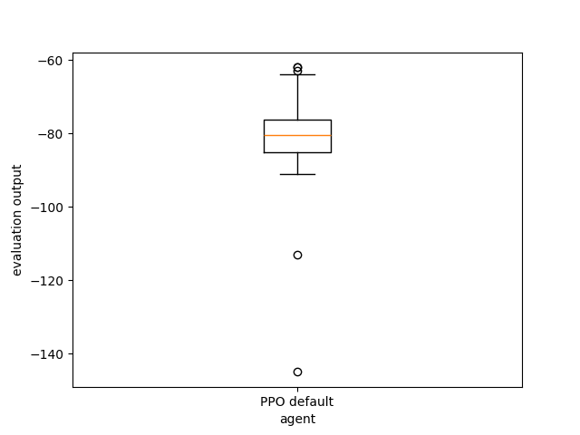
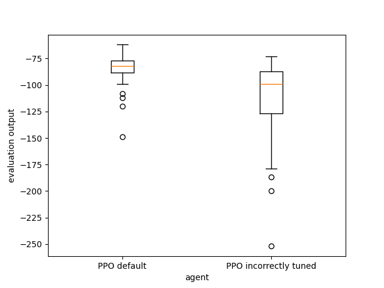

Deep Reinforcement Learning in rlberry
=======================================

..
  Authors: Riccardo Della Vecchia, Hector Kohler, Alena Schilova.

In this tutorial, we will focus on Deep Reinforcement Learning with the **Actor-Advantage Critic** algorithm.

Imports
-----------------------------

.. code:: ipython3

    from rlberry.envs import gym_make
    from rlberry.manager import plot_writer_data, AgentManager, evaluate_agents
    from rlberry.agents.torch import A2CAgent
    from rlberry.agents.torch.utils.training import model_factory_from_env

Reminder of the RL setting
--------------------------

We will consider a MDP :math:`M = (\mathcal{S}, \mathcal{A}, p, r, \gamma)` with:

* :math:`\mathcal{S}` the state space,
* :math:`\mathcal{A}` the action space,
* :math:`p(x^\prime \mid x, a)` the transition probability,
* :math:`r(x, a, x^\prime)` the reward of the transition :math:`(x, a, x^\prime)`,
* :math:`\gamma \in [0,1)` is the discount factor.

A policy :math:`\pi` is a mapping from the state space :math:`\mathcal{S}` to the probability of selecting each action.
The action value function of a policy is the overall expected reward
from a state action.
:math:`Q^\pi(s, a) = \mathbb{E}_{\tau \sim \pi}\big[R(\tau) \mid s_0=s, a_0=a\big]`
where :math:`\tau` is an episode
:math:`(s_0, a_0, r_0, s_1, a_1, r_1, s_2, ..., s_T, a_T, r_T)` with the
actions drawn from :math:`\pi(s)`; :math:`R(\tau)` is the random
variable defined as the cumulative sum of the discounted reward.

The goal is to maximize the cumulative sum of discount rewards:

.. math::  J(\pi) = \mathbb{E}_{\tau \sim \pi}\big[R(\tau) \big]

Gym Environment
---------------

In this tutorial we are going to use the `OpenAI’s Gym
library <https://gym.openai.com/envs/>`__. This library provides a large
number of environments to test RL algorithm.

We will focus only on the **CartPole-v1** environment, although we recommend experimenting with other environments such as **Acrobot-v1**
and **MountainCar-v0**.
The following table presents some
basic components of the three environments, such as the dimensions of
their observation and action spaces and the rewards occurring at each
step.

===================== =========== =========================
Env Info              CartPole-v1 Acrobot-v1                MountainCar-v0
===================== =========== =========================
**Observation Space** Box(4)      Box(6)                    Box(2)
**Action Space**      Discrete(2) Discrete(3)               Discrete(3)
**Rewards**           1 per step  -1 if not terminal else 0 -1 per step
===================== =========== =========================

Actor-Critic algorithms and A2C
-------------------------------

**Actor-Critic algorithms** methods consist of two models, which may
optionally share parameters:

- Critic updates the value function parameters w and depending on the algorithm it could be action-value
:math:`Q_{\varphi}(s,a )` or state-value :math:`V_{\varphi}(s)`.
- Actor updates the policy parameters :math:`\theta` for
:math:`\pi_{\theta}(a \mid s)`, in the direction suggested by the
critic.

**A2C** is an Actor-Critic algorithm and it is part of the on-policy
family, which means that we are learning the value function for one
policy while following it. The original paper in which it was proposed
can be found `here <https://arxiv.org/pdf/1602.01783.pdf>`__ and the
pseudocode of the algorithm is the following:

-  Initialize the actor :math:`\pi_{\theta}` and the critic
   :math:`V_{\varphi}` with random weights.
-  Observe the initial state :math:`s_{0}`.
-  for :math:`t \in\left[0, T_{\text {total }}\right]` :

   -  Initialize empty episode minibatch.
   -  for :math:`k \in[0, n]:` # Sample episode

      -  Select a action :math:`a_{k}` using the actor
         :math:`\pi_{\theta}`.
      -  Perform the action :math:`a_{k}` and observe the next state
         :math:`s_{k+1}` and the reward :math:`r_{k+1}`.
      -  Store :math:`\left(s_{k}, a_{k}, r_{k+1}\right)` in the episode
         minibatch.

   -  if :math:`s_{n}` is not terminal: set
      :math:`R=V_{\varphi}\left(s_{n}\right)` with the critic, else
      :math:`R=0`.
   -  Reset gradient :math:`d \theta` and :math:`d \varphi` to 0 .
   -  for :math:`k \in[n-1,0]` : # Backwards iteration over the episode

      -  Update the discounted sum of rewards
         :math:`R \leftarrow r_{k}+\gamma R`
      -  Accumulate the policy gradient using the critic:

         .. math::

            d \theta \leftarrow d \theta+\nabla_{\theta} \log \pi_{\theta}\left(a_{k}\mid s_{k}\right)\left(R-V_{\varphi}\left(s_{k}\right)\right)

      -  Accumulate the critic gradient:

.. math::

   d \varphi \leftarrow d \varphi+\nabla_{\varphi}\left(R-V_{\varphi}\left(s_{k}\right)\right)^{2}

-  Update the actor and the critic with the accumulated gradients using
   gradient descent or similar:

.. math::

   \theta \leftarrow \theta+\eta d \theta \quad \varphi \leftarrow \varphi+\eta d \varphi

Running A2C on CartPole
-----------------------

In the next example we use default parameters for both the Actor and the
Critic and we use rlberry to train and evaluate our A2C agent. The
default networks are:

-  a dense neural network with two hidden layers of 64 units for the
   **Actor**, the input layer has the dimension of the state space while
   the output layer has the dimension of the action space. The
   activations are RELU functions and we have a softmax in the last
   layer.
-  a dense neural network with two hidden layers of 64 units for the
   **Critic**, the input layer has the dimension of the state space
   while the output has dimension 1. The activations are RELU functions
   apart from the last layer that has a linear activation.

.. code:: python

    """
    The AgentManager class is compact way of experimenting with a deepRL agent.
    """
    default_agent = AgentManager(
        A2CAgent,  # The Agent class.
        (gym_make, dict(id="CartPole-v1")),  # The Environment to solve.
        fit_budget=3e5,  # The number of interactions
        # between the agent and the
        # environment during training.
        eval_kwargs=dict(eval_horizon=500),  # The number of interactions
        # between the agent and the
        # environment during evaluations.
        n_fit=1,  # The number of agents to train.
        # Usually, it is good to do more
        # than 1 because the training is
        # stochastic.
        agent_name="A2C default",  # The agent's name.
    )

    print("Training ...")
    default_agent.fit()  # Trains the agent on fit_budget steps!

    # Plot the training data:
    _ = plot_writer_data(
        [default_agent],
        tag="episode_rewards",
        title="Training Episode Cumulative Rewards",
        show=True,
    )

.. parsed-literal::

    [INFO] Running AgentManager fit() for A2C default with n_fit = 1 and max_workers = None.
    INFO: Making new env: CartPole-v1
    INFO: Making new env: CartPole-v1
    [INFO] Could not find least used device (nvidia-smi might be missing), use cuda:0 instead

.. parsed-literal::

    Training ...

.. parsed-literal::

    [INFO] [A2C default[worker: 0]] | max_global_step = 5644 | episode_rewards = 196.0 | total_episodes = 111 |
    [INFO] [A2C default[worker: 0]] | max_global_step = 9551 | episode_rewards = 380.0 | total_episodes = 134 |
    [INFO] [A2C default[worker: 0]] | max_global_step = 13128 | episode_rewards = 125.0 | total_episodes = 182 |
    [INFO] [A2C default[worker: 0]] | max_global_step = 16617 | episode_rewards = 246.0 | total_episodes = 204 |
    [INFO] [A2C default[worker: 0]] | max_global_step = 20296 | episode_rewards = 179.0 | total_episodes = 222 |
    [INFO] [A2C default[worker: 0]] | max_global_step = 23633 | episode_rewards = 120.0 | total_episodes = 240 |
    [INFO] [A2C default[worker: 0]] | max_global_step = 26193 | episode_rewards = 203.0 | total_episodes = 252 |
    [INFO] [A2C default[worker: 0]] | max_global_step = 28969 | episode_rewards = 104.0 | total_episodes = 271 |
    [INFO] [A2C default[worker: 0]] | max_global_step = 34757 | episode_rewards = 123.0 | total_episodes = 335 |
    [INFO] [A2C default[worker: 0]] | max_global_step = 41554 | episode_rewards = 173.0 | total_episodes = 373 |
    [INFO] [A2C default[worker: 0]] | max_global_step = 48418 | episode_rewards = 217.0 | total_episodes = 423 |
    [INFO] [A2C default[worker: 0]] | max_global_step = 55322 | episode_rewards = 239.0 | total_episodes = 446 |
    [INFO] [A2C default[worker: 0]] | max_global_step = 62193 | episode_rewards = 218.0 | total_episodes = 471 |
    [INFO] [A2C default[worker: 0]] | max_global_step = 69233 | episode_rewards = 377.0 | total_episodes = 509 |
    [INFO] [A2C default[worker: 0]] | max_global_step = 76213 | episode_rewards = 211.0 | total_episodes = 536 |
    [INFO] [A2C default[worker: 0]] | max_global_step = 83211 | episode_rewards = 212.0 | total_episodes = 562 |
    [INFO] [A2C default[worker: 0]] | max_global_step = 90325 | episode_rewards = 211.0 | total_episodes = 586 |
    [INFO] [A2C default[worker: 0]] | max_global_step = 97267 | episode_rewards = 136.0 | total_episodes = 631 |
    [INFO] [A2C default[worker: 0]] | max_global_step = 104280 | episode_rewards = 175.0 | total_episodes = 686 |
    [INFO] [A2C default[worker: 0]] | max_global_step = 111194 | episode_rewards = 258.0 | total_episodes = 722 |
    [INFO] [A2C default[worker: 0]] | max_global_step = 118067 | episode_rewards = 235.0 | total_episodes = 755 |
    [INFO] [A2C default[worker: 0]] | max_global_step = 125040 | episode_rewards = 500.0 | total_episodes = 777 |
    [INFO] [A2C default[worker: 0]] | max_global_step = 132478 | episode_rewards = 500.0 | total_episodes = 792 |
    [INFO] [A2C default[worker: 0]] | max_global_step = 139591 | episode_rewards = 197.0 | total_episodes = 813 |
    [INFO] [A2C default[worker: 0]] | max_global_step = 146462 | episode_rewards = 500.0 | total_episodes = 835 |
    [INFO] [A2C default[worker: 0]] | max_global_step = 153462 | episode_rewards = 500.0 | total_episodes = 849 |
    [INFO] [A2C default[worker: 0]] | max_global_step = 160462 | episode_rewards = 500.0 | total_episodes = 863 |
    [INFO] [A2C default[worker: 0]] | max_global_step = 167462 | episode_rewards = 500.0 | total_episodes = 877 |
    [INFO] [A2C default[worker: 0]] | max_global_step = 174462 | episode_rewards = 500.0 | total_episodes = 891 |
    [INFO] [A2C default[worker: 0]] | max_global_step = 181462 | episode_rewards = 500.0 | total_episodes = 905 |
    [INFO] [A2C default[worker: 0]] | max_global_step = 188462 | episode_rewards = 500.0 | total_episodes = 919 |
    [INFO] [A2C default[worker: 0]] | max_global_step = 195462 | episode_rewards = 500.0 | total_episodes = 933 |
    [INFO] [A2C default[worker: 0]] | max_global_step = 202520 | episode_rewards = 206.0 | total_episodes = 957 |
    [INFO] [A2C default[worker: 0]] | max_global_step = 209932 | episode_rewards = 500.0 | total_episodes = 978 |
    [INFO] [A2C default[worker: 0]] | max_global_step = 216932 | episode_rewards = 500.0 | total_episodes = 992 |
    [INFO] [A2C default[worker: 0]] | max_global_step = 223932 | episode_rewards = 500.0 | total_episodes = 1006 |
    [INFO] [A2C default[worker: 0]] | max_global_step = 230916 | episode_rewards = 214.0 | total_episodes = 1024 |
    [INFO] [A2C default[worker: 0]] | max_global_step = 235895 | episode_rewards = 500.0 | total_episodes = 1037 |
    [INFO] [A2C default[worker: 0]] | max_global_step = 242782 | episode_rewards = 118.0 | total_episodes = 1072 |
    [INFO] [A2C default[worker: 0]] | max_global_step = 249695 | episode_rewards = 131.0 | total_episodes = 1111 |
    [INFO] [A2C default[worker: 0]] | max_global_step = 256649 | episode_rewards = 136.0 | total_episodes = 1160 |
    [INFO] [A2C default[worker: 0]] | max_global_step = 263674 | episode_rewards = 100.0 | total_episodes = 1215 |
    [INFO] [A2C default[worker: 0]] | max_global_step = 270727 | episode_rewards = 136.0 | total_episodes = 1279 |
    [INFO] [A2C default[worker: 0]] | max_global_step = 277588 | episode_rewards = 275.0 | total_episodes = 1313 |
    [INFO] [A2C default[worker: 0]] | max_global_step = 284602 | episode_rewards = 136.0 | total_episodes = 1353 |
    [INFO] [A2C default[worker: 0]] | max_global_step = 291609 | episode_rewards = 117.0 | total_episodes = 1413 |
    [INFO] [A2C default[worker: 0]] | max_global_step = 298530 | episode_rewards = 147.0 | total_episodes = 1466 |
    [INFO] ... trained!
    INFO: Making new env: CartPole-v1
    INFO: Making new env: CartPole-v1
    [INFO] Could not find least used device (nvidia-smi might be missing), use cuda:0 instead

.. image:: output_5_3.png

.. code:: ipython3

    print("Evaluating ...")
    _ = evaluate_agents([default_agent], n_simulations=50, show = True)   # Evaluate the trained agent on
                                                                          # 10 simulations of 500 steps each.

.. parsed-literal::

    [INFO] Evaluating A2C default...

.. parsed-literal::

    Evaluating ...

.. parsed-literal::

    [INFO] [eval]... simulation 1/50
    [INFO] [eval]... simulation 2/50
    [INFO] [eval]... simulation 3/50
    [INFO] [eval]... simulation 4/50
    [INFO] [eval]... simulation 5/50
    [INFO] [eval]... simulation 6/50
    [INFO] [eval]... simulation 7/50
    [INFO] [eval]... simulation 8/50
    [INFO] [eval]... simulation 9/50
    [INFO] [eval]... simulation 10/50
    [INFO] [eval]... simulation 11/50
    [INFO] [eval]... simulation 12/50
    [INFO] [eval]... simulation 13/50
    [INFO] [eval]... simulation 14/50
    [INFO] [eval]... simulation 15/50
    [INFO] [eval]... simulation 16/50
    [INFO] [eval]... simulation 17/50
    [INFO] [eval]... simulation 18/50
    [INFO] [eval]... simulation 19/50
    [INFO] [eval]... simulation 20/50
    [INFO] [eval]... simulation 21/50
    [INFO] [eval]... simulation 22/50
    [INFO] [eval]... simulation 23/50
    [INFO] [eval]... simulation 24/50
    [INFO] [eval]... simulation 25/50
    [INFO] [eval]... simulation 26/50
    [INFO] [eval]... simulation 27/50
    [INFO] [eval]... simulation 28/50
    [INFO] [eval]... simulation 29/50
    [INFO] [eval]... simulation 30/50
    [INFO] [eval]... simulation 31/50
    [INFO] [eval]... simulation 32/50
    [INFO] [eval]... simulation 33/50
    [INFO] [eval]... simulation 34/50
    [INFO] [eval]... simulation 35/50
    [INFO] [eval]... simulation 36/50
    [INFO] [eval]... simulation 37/50
    [INFO] [eval]... simulation 38/50
    [INFO] [eval]... simulation 39/50
    [INFO] [eval]... simulation 40/50
    [INFO] [eval]... simulation 41/50
    [INFO] [eval]... simulation 42/50
    [INFO] [eval]... simulation 43/50
    [INFO] [eval]... simulation 44/50
    [INFO] [eval]... simulation 45/50
    [INFO] [eval]... simulation 46/50
    [INFO] [eval]... simulation 47/50
    [INFO] [eval]... simulation 48/50
    [INFO] [eval]... simulation 49/50
    [INFO] [eval]... simulation 50/50

Let’s try to change the neural networks’ architectures and see if we can
beat our previous result. This time we use a smaller learning rate
and bigger batch size to have more stable training.

.. code:: ipython3

    policy_configs = {
        "type": "MultiLayerPerceptron",   # A network architecture
        "layer_sizes": (64,64),           # Network dimensions
        "reshape": False,
        "is_policy": True,                # The network should output a distribution
                                          # over actions
    }

    critic_configs = {
        "type": "MultiLayerPerceptron",
        "layer_sizes": (64,64),
        "reshape": False,
        "out_size": 1,                    # The critic network is an approximator of
                                          # a value function V: States -> |R
    }

.. code:: ipython3

    tuned_agent = AgentManager(
            A2CAgent,                                # The Agent class.

            (gym_make, dict(id = "CartPole-v1")),     # The Environment to solve.

            init_kwargs=dict(                        # Where to put the agent's hyperparameters

                policy_net_fn=model_factory_from_env,  # A policy network constructor

                policy_net_kwargs=policy_configs,      # Policy network's architecure

                value_net_fn = model_factory_from_env, # A Critic network constructor

                value_net_kwargs=critic_configs,      # Critic network's architecure.

                optimizer_type = "ADAM",          # What optimizer to use for policy
                                                      # gradient descent steps.

                learning_rate=1e-3,                   # Size of the policy gradient
                                                      # descent steps.

                entr_coef = 0.0,                       # How much to force exploration.

                batch_size = 1024                       # Number of interactions used to
                                                     # estimate the policy gradient
                                                     # for each policy update.
            ),

            fit_budget=3e5,                          # The number of interactions
                                                     # between the agent and the
                                                     # environment during training.

            eval_kwargs=dict(eval_horizon=500),      # The number of interactions
                                                     # between the agent and the
                                                     # environment during evaluations.

            n_fit=1,                                 # The number of agents to train.
                                                     # Usually, it is good to do more
                                                     # than 1 because the training is
                                                     # stochastic.

            agent_name = "A2C tuned",              # The agent's name.

        )

    print("Training ...")
    tuned_agent.fit()                              # Trains the agent on fit_budget steps!

    # Plot the training data:
    _ = plot_writer_data(
            [default_agent, tuned_agent],
            tag="episode_rewards",
            title="Training Episode Cumulative Rewards",
            show=True,
          )

.. parsed-literal::

    [INFO] Running AgentManager fit() for A2C tuned with n_fit = 1 and max_workers = None.
    INFO: Making new env: CartPole-v1
    INFO: Making new env: CartPole-v1
    [INFO] Could not find least used device (nvidia-smi might be missing), use cuda:0 instead

.. parsed-literal::

    Training ...

.. parsed-literal::

    [INFO] [A2C tuned[worker: 0]] | max_global_step = 6777 | episode_rewards = 15.0 | total_episodes = 314 |
    [INFO] [A2C tuned[worker: 0]] | max_global_step = 13633 | episode_rewards = 14.0 | total_episodes = 602 |
    [INFO] [A2C tuned[worker: 0]] | max_global_step = 20522 | episode_rewards = 41.0 | total_episodes = 854 |
    [INFO] [A2C tuned[worker: 0]] | max_global_step = 27531 | episode_rewards = 13.0 | total_episodes = 1063 |
    [INFO] [A2C tuned[worker: 0]] | max_global_step = 34398 | episode_rewards = 42.0 | total_episodes = 1237 |
    [INFO] [A2C tuned[worker: 0]] | max_global_step = 41600 | episode_rewards = 118.0 | total_episodes = 1389 |
    [INFO] [A2C tuned[worker: 0]] | max_global_step = 48593 | episode_rewards = 50.0 | total_episodes = 1511 |
    [INFO] [A2C tuned[worker: 0]] | max_global_step = 55721 | episode_rewards = 113.0 | total_episodes = 1603 |
    [INFO] [A2C tuned[worker: 0]] | max_global_step = 62751 | episode_rewards = 41.0 | total_episodes = 1687 |
    [INFO] [A2C tuned[worker: 0]] | max_global_step = 69968 | episode_rewards = 344.0 | total_episodes = 1741 |
    [INFO] [A2C tuned[worker: 0]] | max_global_step = 77259 | episode_rewards = 418.0 | total_episodes = 1787 |
    [INFO] [A2C tuned[worker: 0]] | max_global_step = 84731 | episode_rewards = 293.0 | total_episodes = 1820 |
    [INFO] [A2C tuned[worker: 0]] | max_global_step = 91890 | episode_rewards = 185.0 | total_episodes = 1853 |
    [INFO] [A2C tuned[worker: 0]] | max_global_step = 99031 | episode_rewards = 278.0 | total_episodes = 1876 |
    [INFO] [A2C tuned[worker: 0]] | max_global_step = 106305 | episode_rewards = 318.0 | total_episodes = 1899 |
    [INFO] [A2C tuned[worker: 0]] | max_global_step = 113474 | episode_rewards = 500.0 | total_episodes = 1921 |
    [INFO] [A2C tuned[worker: 0]] | max_global_step = 120632 | episode_rewards = 370.0 | total_episodes = 1941 |
    [INFO] [A2C tuned[worker: 0]] | max_global_step = 127753 | episode_rewards = 375.0 | total_episodes = 1962 |
    [INFO] [A2C tuned[worker: 0]] | max_global_step = 135179 | episode_rewards = 393.0 | total_episodes = 1987 |
    [INFO] [A2C tuned[worker: 0]] | max_global_step = 142433 | episode_rewards = 500.0 | total_episodes = 2005 |
    [INFO] [A2C tuned[worker: 0]] | max_global_step = 149888 | episode_rewards = 500.0 | total_episodes = 2023 |
    [INFO] [A2C tuned[worker: 0]] | max_global_step = 157312 | episode_rewards = 467.0 | total_episodes = 2042 |
    [INFO] [A2C tuned[worker: 0]] | max_global_step = 164651 | episode_rewards = 441.0 | total_episodes = 2060 |
    [INFO] [A2C tuned[worker: 0]] | max_global_step = 172015 | episode_rewards = 500.0 | total_episodes = 2076 |
    [INFO] [A2C tuned[worker: 0]] | max_global_step = 178100 | episode_rewards = 481.0 | total_episodes = 2089 |
    [INFO] [A2C tuned[worker: 0]] | max_global_step = 183522 | episode_rewards = 462.0 | total_episodes = 2101 |
    [INFO] [A2C tuned[worker: 0]] | max_global_step = 190818 | episode_rewards = 500.0 | total_episodes = 2117 |
    [INFO] [A2C tuned[worker: 0]] | max_global_step = 198115 | episode_rewards = 500.0 | total_episodes = 2135 |
    [INFO] [A2C tuned[worker: 0]] | max_global_step = 205097 | episode_rewards = 500.0 | total_episodes = 2151 |
    [INFO] [A2C tuned[worker: 0]] | max_global_step = 212351 | episode_rewards = 500.0 | total_episodes = 2166 |
    [INFO] [A2C tuned[worker: 0]] | max_global_step = 219386 | episode_rewards = 500.0 | total_episodes = 2181 |
    [INFO] [A2C tuned[worker: 0]] | max_global_step = 226386 | episode_rewards = 500.0 | total_episodes = 2195 |
    [INFO] [A2C tuned[worker: 0]] | max_global_step = 233888 | episode_rewards = 500.0 | total_episodes = 2211 |
    [INFO] [A2C tuned[worker: 0]] | max_global_step = 241388 | episode_rewards = 500.0 | total_episodes = 2226 |
    [INFO] [A2C tuned[worker: 0]] | max_global_step = 248287 | episode_rewards = 500.0 | total_episodes = 2240 |
    [INFO] [A2C tuned[worker: 0]] | max_global_step = 255483 | episode_rewards = 500.0 | total_episodes = 2255 |
    [INFO] [A2C tuned[worker: 0]] | max_global_step = 262845 | episode_rewards = 500.0 | total_episodes = 2270 |
    [INFO] [A2C tuned[worker: 0]] | max_global_step = 270032 | episode_rewards = 500.0 | total_episodes = 2285 |
    [INFO] [A2C tuned[worker: 0]] | max_global_step = 277009 | episode_rewards = 498.0 | total_episodes = 2301 |
    [INFO] [A2C tuned[worker: 0]] | max_global_step = 284044 | episode_rewards = 255.0 | total_episodes = 2318 |
    [INFO] [A2C tuned[worker: 0]] | max_global_step = 291189 | episode_rewards = 500.0 | total_episodes = 2334 |
    [INFO] [A2C tuned[worker: 0]] | max_global_step = 298619 | episode_rewards = 500.0 | total_episodes = 2350 |
    [INFO] ... trained!
    INFO: Making new env: CartPole-v1
    INFO: Making new env: CartPole-v1
    [INFO] Could not find least used device (nvidia-smi might be missing), use cuda:0 instead

.. image:: output_9_3.png

.. code:: ipython3

    print("Evaluating ...")

    # Evaluate each trained agent on 10 simulations of 500 steps each.
    _ = evaluate_agents([default_agent, tuned_agent], n_simulations=50, show = True)

.. parsed-literal::

    [INFO] Evaluating A2C default...

.. parsed-literal::

    Evaluating ...

.. parsed-literal::

    [INFO] [eval]... simulation 1/50
    [INFO] [eval]... simulation 2/50
    [INFO] [eval]... simulation 3/50
    [INFO] [eval]... simulation 4/50
    [INFO] [eval]... simulation 5/50
    [INFO] [eval]... simulation 6/50
    [INFO] [eval]... simulation 7/50
    [INFO] [eval]... simulation 8/50
    [INFO] [eval]... simulation 9/50
    [INFO] [eval]... simulation 10/50
    [INFO] [eval]... simulation 11/50
    [INFO] [eval]... simulation 12/50
    [INFO] [eval]... simulation 13/50
    [INFO] [eval]... simulation 14/50
    [INFO] [eval]... simulation 15/50
    [INFO] [eval]... simulation 16/50
    [INFO] [eval]... simulation 17/50
    [INFO] [eval]... simulation 18/50
    [INFO] [eval]... simulation 19/50
    [INFO] [eval]... simulation 20/50
    [INFO] [eval]... simulation 21/50
    [INFO] [eval]... simulation 22/50
    [INFO] [eval]... simulation 23/50
    [INFO] [eval]... simulation 24/50
    [INFO] [eval]... simulation 25/50
    [INFO] [eval]... simulation 26/50
    [INFO] [eval]... simulation 27/50
    [INFO] [eval]... simulation 28/50
    [INFO] [eval]... simulation 29/50
    [INFO] [eval]... simulation 30/50
    [INFO] [eval]... simulation 31/50
    [INFO] [eval]... simulation 32/50
    [INFO] [eval]... simulation 33/50
    [INFO] [eval]... simulation 34/50
    [INFO] [eval]... simulation 35/50
    [INFO] [eval]... simulation 36/50
    [INFO] [eval]... simulation 37/50
    [INFO] [eval]... simulation 38/50
    [INFO] [eval]... simulation 39/50
    [INFO] [eval]... simulation 40/50
    [INFO] [eval]... simulation 41/50
    [INFO] [eval]... simulation 42/50
    [INFO] [eval]... simulation 43/50
    [INFO] [eval]... simulation 44/50
    [INFO] [eval]... simulation 45/50
    [INFO] [eval]... simulation 46/50
    [INFO] [eval]... simulation 47/50
    [INFO] [eval]... simulation 48/50
    [INFO] [eval]... simulation 49/50
    [INFO] [eval]... simulation 50/50
    [INFO] Evaluating A2C tuned...
    [INFO] [eval]... simulation 1/50
    [INFO] [eval]... simulation 2/50
    [INFO] [eval]... simulation 3/50
    [INFO] [eval]... simulation 4/50
    [INFO] [eval]... simulation 5/50
    [INFO] [eval]... simulation 6/50
    [INFO] [eval]... simulation 7/50
    [INFO] [eval]... simulation 8/50
    [INFO] [eval]... simulation 9/50
    [INFO] [eval]... simulation 10/50
    [INFO] [eval]... simulation 11/50
    [INFO] [eval]... simulation 12/50
    [INFO] [eval]... simulation 13/50
    [INFO] [eval]... simulation 14/50
    [INFO] [eval]... simulation 15/50
    [INFO] [eval]... simulation 16/50
    [INFO] [eval]... simulation 17/50
    [INFO] [eval]... simulation 18/50
    [INFO] [eval]... simulation 19/50
    [INFO] [eval]... simulation 20/50
    [INFO] [eval]... simulation 21/50
    [INFO] [eval]... simulation 22/50
    [INFO] [eval]... simulation 23/50
    [INFO] [eval]... simulation 24/50
    [INFO] [eval]... simulation 25/50
    [INFO] [eval]... simulation 26/50
    [INFO] [eval]... simulation 27/50
    [INFO] [eval]... simulation 28/50
    [INFO] [eval]... simulation 29/50
    [INFO] [eval]... simulation 30/50
    [INFO] [eval]... simulation 31/50
    [INFO] [eval]... simulation 32/50
    [INFO] [eval]... simulation 33/50
    [INFO] [eval]... simulation 34/50
    [INFO] [eval]... simulation 35/50
    [INFO] [eval]... simulation 36/50
    [INFO] [eval]... simulation 37/50
    [INFO] [eval]... simulation 38/50
    [INFO] [eval]... simulation 39/50
    [INFO] [eval]... simulation 40/50
    [INFO] [eval]... simulation 41/50
    [INFO] [eval]... simulation 42/50
    [INFO] [eval]... simulation 43/50
    [INFO] [eval]... simulation 44/50
    [INFO] [eval]... simulation 45/50
    [INFO] [eval]... simulation 46/50
    [INFO] [eval]... simulation 47/50
    [INFO] [eval]... simulation 48/50
    [INFO] [eval]... simulation 49/50
    [INFO] [eval]... simulation 50/50

