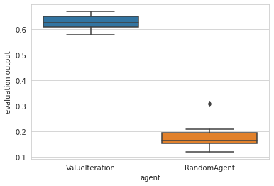
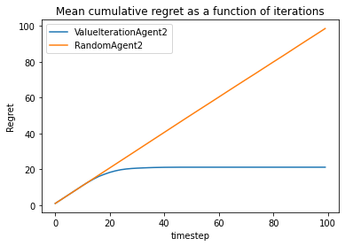

.. _quick_start:

Quick Start
-----------

In this small tutorial, you will learn how to compare two agents on a basic
Gridworld environment.

Libraries
~~~~~~~~~

.. code:: ipython3

    import numpy as np
    import pandas as pd
    from rlberry.agents import ValueIterationAgent, AgentWithSimplePolicy
    from rlberry.envs import GridWorld
    from rlberry.manager import AgentManager, evaluate_agents

Environment definition
~~~~~~~~~~~~~~~~~~~~~~

A grid world is a simple environment with finite states and actions, on
which we can test simple algorithms. \* The reward function can be
accessed by: env.R[state, action] \* And the transitions: env.P[state,
action, next_state]

.. code:: ipython3

    env_ctor = GridWorld
    env_kwargs =dict(nrows=3, ncols=10,
                    reward_at = {(1,1):0.1, (2, 9):1.0},
                    walls=((1,4),(2,4), (1,5)),
                    success_probability=0.7)
    env = env_ctor(**env_kwargs)

As an indication :

-  nrows: number of rows
-  ncols: number of columns
-  success_probability: probability of moving in the chosen direction

Agents definition
~~~~~~~~~~~~~~~~~

We will compare a RandomAgent (which play random action) to a
ValueIterationAgent. Our goal is then to assess the performance of the
two algorithms.

.. code:: ipython3

    # Create random agent as a baseline
    class RandomAgent(AgentWithSimplePolicy):
        name = 'RandomAgent'
        def __init__(self, env, **kwargs):
            AgentWithSimplePolicy.__init__(self, env, **kwargs)

        def fit(self, budget=None, **kwargs):
            pass

        def policy(self, observation):
            return self.env.action_space.sample()

    # We will compare this agent to V

    # Define parameters
    vi_params = {'gamma':0.1, 'epsilon':1e-3}

Running the experiments
~~~~~~~~~~~~~~~~~~~~~~~

.. code:: ipython3

    # Create AgentManager to fit 4 agents using 1 job
    vi_stats = AgentManager(
        ValueIterationAgent,
        (env_ctor, env_kwargs),
        fit_budget=0,
        eval_kwargs=dict(eval_horizon=20),
        init_kwargs=vi_params,
        n_fit=1)
    vi_stats.fit()

    # Create AgentManager for baseline
    baseline_stats = AgentManager(
        RandomAgent,
        (env_ctor, env_kwargs),
        fit_budget=0,
        eval_kwargs=dict(eval_horizon=20),
        n_fit=1)
    baseline_stats.fit()

Compare average reward of the obtained policies using 10 Monte Carlo simulations
~~~~~~~~~~~~~~~~~~~~~~~~~~~~~~~~~~~~~~~~~~~~~~~~~~~~~~~~~~~~~~~~~~~~~~~~~~~~~~~~

We want to compare the mean rewards. To do that we use 10 Monte-Carlo
simulations.

In each of the smulation, we estimate the mean reward using 10
Monte-Carlo simulations. In total 100 MC simulations.

We plot the boxplots of the associated means.

.. code:: ipython3

    output = evaluate_agents([vi_stats, baseline_stats], n_simulations=10, plot=True)

Getting all the rewards an not only the last one
~~~~~~~~~~~~~~~~~~~~~~~~~~~~~~~~~~~~~~~~~~~~~~~~

To do that, we have to redefine the ``eval`` function of our agents that
tells us what evaluation is returned.

.. code:: ipython3

    class RandomAgent2(RandomAgent):
        name = 'RandomAgent2'
        def __init__(self, env, **kwargs):
            super().__init__(env, **kwargs)

        def eval(self,
                 eval_horizon=10 ** 5,
                 **kwargs):
            del kwargs  # unused
            episode_regret = np.zeros(eval_horizon)
            observation = self.eval_env.reset()
            for tt in range(eval_horizon):
                action = self.policy(observation)
                observation, reward, done, _ = self.eval_env.step(action)
                episode_regret[tt] = 1-reward
            return episode_regret

    class ValueIterationAgent2(ValueIterationAgent):
        name = 'ValueIterationAgent2'
        def __init__(self, env, gamma=0.95, horizon=None, epsilon=1e-6, **kwargs):
            super().__init__( env, gamma=0.95, horizon=None, epsilon=1e-6, **kwargs)

        def eval(self,
                 eval_horizon=10 ** 5,
                 gamma=1,
                 **kwargs):
            del kwargs  # unused
            episode_regret = np.zeros(eval_horizon)
            observation = self.eval_env.reset()
            for tt in range(eval_horizon):
                action = self.policy(observation)
                observation, reward, done, _ = self.eval_env.step(action)
                episode_regret[tt] = 1-reward

            return episode_regret

.. code:: ipython3

    # Create AgentManager to fit 4 agents using 1 job
    vi_stats = AgentManager(
        ValueIterationAgent2,
        (env_ctor, env_kwargs),
        fit_budget=1,
        eval_kwargs=dict(eval_horizon=100),
        init_kwargs=vi_params,
        n_fit=4)
    vi_stats.fit()

    # Create AgentManager for baseline
    baseline_stats = AgentManager(
        RandomAgent2,
        (env_ctor, env_kwargs),
        fit_budget=1,
        eval_kwargs=dict(eval_horizon=100),
        n_fit=1)
    baseline_stats.fit()

.. code:: ipython3

    output = evaluate_agents([vi_stats, baseline_stats], n_simulations=100, plot=False)

.. code:: ipython3

    regret = pd.DataFrame(np.array([np.array(output[agent].values.tolist()).cumsum(axis=1).mean(axis=0) for agent in output.columns]).T, columns=output.columns)

.. code:: ipython3

    regret.plot(xlabel = 'timestep', ylabel = 'Regret', title="Mean cumulative regret as a function of iterations")

