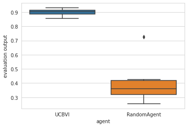
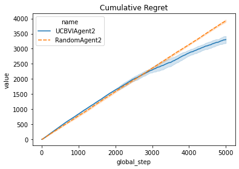

.. _quick_start:

Quick Start
===========

Importing required libraries
----------------------------

.. code:: python

    import numpy as np
    import pandas as pd
    import time
    from rlberry.agents import UCBVIAgent, AgentWithSimplePolicy
    from rlberry.envs import Chain
    from rlberry.manager import AgentManager, evaluate_agents, plot_writer_data
    from rlberry.wrappers import WriterWrapper

Choosing an RL environment
--------------------------

In this tutorial, we will use the :class:`~rlberry.envs.finite.chain.Chain`
environment, which is a very simple environment where the agent has to go from one
end of a chain to the other end.

.. code:: python

    env_ctor = Chain
    env_kwargs =dict(L=10, fail_prob=0.1)
    # chain of length 10. With proba 0.2, the agent will not be able to take the action it wants to take/
    env = env_ctor(**env_kwargs)

Let us see a graphical representation

.. code:: python

    env.enable_rendering()
    state = env.reset()
    for tt in range(5):
        next_s, _, done, _ = env.step(1)
        state = next_s
    video = env.save_video("video_chain.mp4", framerate=5)

The agent has two actions, go to the left of to the right, but it might
move to a random direction according to a failure probability ``fail_prob=0.1``.

.. video:: ../video_chain_quickstart.mp4
   :width: 600

Defining an agent and a baseline
--------------------------------

We will compare a RandomAgent (which plays random action) to the
:class:`~rlberry.agents.ucbvi.ucbvi.UCBVIAgent`, which
is a algorithm that is designed to perform an efficient exploration. 
Our goal is then to assess the performance of the two algorithms.

.. code:: python

    # Create random agent as a baseline
    class RandomAgent(AgentWithSimplePolicy):
        name = 'RandomAgent'
        def __init__(self, env, **kwargs):
            AgentWithSimplePolicy.__init__(self, env, **kwargs)

        def fit(self, budget=100, **kwargs):
            observation = self.env.reset()
            for ep in range(budget):
                action = self.policy(observation)
                observation, reward, done, _ = self.env.step(action)

        def policy(self, observation):
            return self.env.action_space.sample() # choose an action at random

    # Define parameters
    ucbvi_params = {'gamma':0.1, 'horizon':100}

There are a number of agents that are already coded in rlberry. See the
module ``rlberry.agent`` for more informations.

Comparing the expected rewards of the final policies
--------------------------------------------------

We want to assess the expected reward of the policy learned by our agents
for a time horizon of (say) :math:`T=20`.

To do that we use 10 Monte-Carlo simulations, i.e., we do the experiment
10 times for each agent and at the end we take the mean of the 10
obtained reward.

This gives us 1 value per agent. We do this 10 times (so 10 times 10
equal 100 simulations) in order to have an idea of the variability of
our estimation.

In order to manage the agents, we use an Agent Manager. The manager will
then spawn agents as desired during the experiment.

.. code:: python

    # Create AgentManager to fit 4 agents using 1 job
    ucbvi_stats = AgentManager(
        UCBVIAgent,
        (env_ctor, env_kwargs),
        fit_budget=100,
        eval_kwargs=dict(eval_horizon=20,n_simimulations=10),
        init_kwargs=ucbvi_params,
        n_fit=1)
    ucbvi_stats.fit()

    # Create AgentManager for baseline
    baseline_stats = AgentManager(
        RandomAgent,
        (env_ctor, env_kwargs),
        fit_budget=100,
        eval_kwargs=dict(eval_horizon=20,n_simimulations=10),
        n_fit=1)
    baseline_stats.fit()

.. code:: python

    output = evaluate_agents([ucbvi_stats, baseline_stats], n_simulations=10, plot=True)

Comparing the agents during the learning period
------------------------------------------------

In the previous section, we compared the performance of the **final** policies learned by
the agents, **after** the learning period.

To compare the performance of the agents **during** the learning period 
(in the fit method), we can estimate their cumulative regret, which is the difference
between the rewards gathered by the agents during training and the
rewards of an optimal agent. Alternatively, if the we cannot compute the optimal
policy, we could simply compare the rewards gathered during learning, instead of the regret.

First, we have to record the reward during the fit as this is not done
automatically. To do this, we can use the :class:`~rlberry.wrappers.writer_utils.WriterWrapper`
module, or simply the `Agent.writer` attribute.

.. code:: python

    class RandomAgent2(RandomAgent):
        name = 'RandomAgent2'
        def __init__(self, env, **kwargs):
            RandomAgent.__init__(self, env, **kwargs)
            self.env = WriterWrapper(self.env, self.writer, write_scalar = "reward")

    class UCBVIAgent2(UCBVIAgent):
        name = 'UCBVIAgent2'
        def __init__(self, env, **kwargs):
            UCBVIAgent.__init__(self, env, **kwargs)
            self.env = WriterWrapper(self.env, self.writer, write_scalar = "reward")

To compute the regret, we also need to define an optimal agent. Here it's an
agent that always chooses the action that moves to the right.

.. code:: python

    class OptimalAgent(AgentWithSimplePolicy):
        name = 'OptimalAgent'
        def __init__(self, env, **kwargs):
            AgentWithSimplePolicy.__init__(self, env, **kwargs)
            self.env = WriterWrapper(self.env, self.writer, write_scalar = "reward")

        def fit(self, budget=100, **kwargs):
            observation = self.env.reset()
            for ep in range(budget):
                action = 1
                observation, reward, done, _ = self.env.step(action)

        def policy(self, observation):
            return 1

Then, we fit the two agents and plot the data in the writer.

.. code:: python

    # Create AgentManager to fit 4 agents using 1 job
    ucbvi_stats = AgentManager(
        UCBVIAgent2,
        (env_ctor, env_kwargs),
        fit_budget=50,
        init_kwargs=ucbvi_params,
        n_fit=10, parallelization='process',mp_context="fork" ) # mp_context is needed to have parallel computing in notebooks.
    ucbvi_stats.fit()

    # Create AgentManager for baseline
    baseline_stats = AgentManager(
        RandomAgent2,
        (env_ctor, env_kwargs),
        fit_budget=5000,
        n_fit=10, parallelization='process', mp_context="fork")
    baseline_stats.fit()

    # Create AgentManager for baseline
    opti_stats = AgentManager(
        OptimalAgent,
        (env_ctor, env_kwargs),
        fit_budget=5000,
        n_fit=10, parallelization='process', mp_context="fork")
    opti_stats.fit()

Remark that ``fit_budget`` may not mean the same thing among agents. For
OptimalAgent and RandomAgent ``fit_budget`` is the number of steps in
the environments that the agent is allowed to take.

The reward that we recover is recorded every time env.step is called.

For UCBVI this is the number of iterations of the algorithm and in each
iteration, the environment takes 100 steps (``horizon``) times the
``fit_budget``. Hence the fit_budget used here

Next, we estimate the optimal reward using the optimal policy.

Be careful that this is only an estimation: we estimate the optimal
regret using Monte Carlo and the optimal policy.

.. code:: python

    df = plot_writer_data(opti_stats, tag='reward', show=False)
    df = df.loc[df['tag']=='reward'][['global_step', 'value']]
    opti_reward = df.groupby('global_step').mean()['value'].values

Finally, we plot the cumulative regret using the 5000 reward values.

.. code:: python

    def compute_regret(rewards):
        return np.cumsum(opti_reward-rewards[:len(opti_reward)])

    # Plot of the cumulative reward.
    output = plot_writer_data([ucbvi_stats, baseline_stats], tag="reward",
                               preprocess_func=compute_regret,
                               title="Cumulative Regret")

