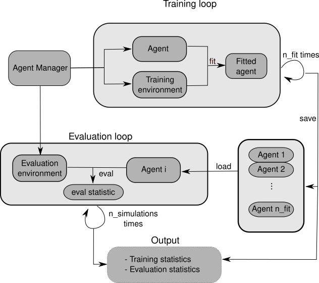
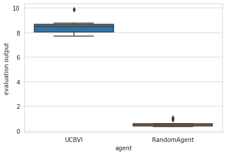
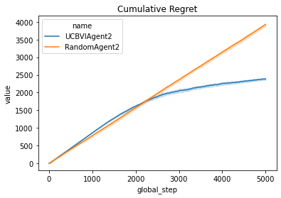

.. _quick_start:

.. highlight:: none
               
Quick Start for Reinforcement Learning in rlberry
=================================================

.. math::

   \def\CC{\bf C}
   \def\QQ{\bf Q}
   \def\RR{\bf R}
   \def\ZZ{\bf Z}
   \def\NN{\bf N}

Importing required libraries
----------------------------

.. code:: python

    import numpy as np
    import pandas as pd
    import time
    from rlberry.agents import UCBVIAgent, AgentWithSimplePolicy
    from rlberry.envs import Chain
    from rlberry.manager import (
        AgentManager,
        evaluate_agents,
        plot_writer_data,
        read_writer_data,
    )
    from rlberry.wrappers import WriterWrapper

Choosing an RL environment
--------------------------

In this tutorial, we will use the :class:`~rlberry.envs.finite.chain.Chain`
environment, which is a very simple environment where the agent has to go from one
end of a chain to the other end.

.. code:: python

    env_ctor = Chain
    env_kwargs = dict(L=10, fail_prob=0.1)
    # chain of length 10. With proba 0.2, the agent will not be able to take the action it wants to take/
    env = env_ctor(**env_kwargs)

Let us see a graphical representation

.. code:: python

    env.enable_rendering()
    state = env.reset()
    for tt in range(5):
        next_s, _, done, _ = env.step(1)
        state = next_s
    video = env.save_video("video_chain.mp4", framerate=5)

.. parsed-literal::
              
    ffmpeg version n5.0 Copyright (c) 2000-2022 the FFmpeg developers
      built with gcc 11.2.0 (GCC)
      configuration: --prefix=/usr --disable-debug --disable-static --disable-stripping --enable-amf --enable-avisynth --enable-cuda-llvm --enable-lto --enable-fontconfig --enable-gmp --enable-gnutls --enable-gpl --enable-ladspa --enable-libaom --enable-libass --enable-libbluray --enable-libdav1d --enable-libdrm --enable-libfreetype --enable-libfribidi --enable-libgsm --enable-libiec61883 --enable-libjack --enable-libmfx --enable-libmodplug --enable-libmp3lame --enable-libopencore_amrnb --enable-libopencore_amrwb --enable-libopenjpeg --enable-libopus --enable-libpulse --enable-librav1e --enable-librsvg --enable-libsoxr --enable-libspeex --enable-libsrt --enable-libssh --enable-libsvtav1 --enable-libtheora --enable-libv4l2 --enable-libvidstab --enable-libvmaf --enable-libvorbis --enable-libvpx --enable-libwebp --enable-libx264 --enable-libx265 --enable-libxcb --enable-libxml2 --enable-libxvid --enable-libzimg --enable-nvdec --enable-nvenc --enable-shared --enable-version3
      libavutil      57. 17.100 / 57. 17.100
      libavcodec     59. 18.100 / 59. 18.100
      libavformat    59. 16.100 / 59. 16.100
      libavdevice    59.  4.100 / 59.  4.100
      libavfilter     8. 24.100 /  8. 24.100
      libswscale      6.  4.100 /  6.  4.100
      libswresample   4.  3.100 /  4.  3.100
      libpostproc    56.  3.100 / 56.  3.100
    Input #0, rawvideo, from 'pipe:':
      Duration: N/A, start: 0.000000, bitrate: 7680 kb/s
      Stream #0:0: Video: rawvideo (RGB[24] / 0x18424752), rgb24, 800x80, 7680 kb/s, 5 tbr, 5 tbn
    Stream mapping:
      Stream #0:0 -> #0:0 (rawvideo (native) -> h264 (libx264))
    [libx264 @ 0x564b9e570340] using cpu capabilities: MMX2 SSE2Fast SSSE3 SSE4.2 AVX FMA3 BMI2 AVX2
    [libx264 @ 0x564b9e570340] profile High, level 1.2, 4:2:0, 8-bit
    [libx264 @ 0x564b9e570340] 264 - core 164 r3081 19856cc - H.264/MPEG-4 AVC codec - Copyleft 2003-2021 - http://www.videolan.org/x264.html - options: cabac=1 ref=3 deblock=1:0:0 analyse=0x3:0x113 me=hex subme=7 psy=1 psy_rd=1.00:0.00 mixed_ref=1 me_range=16 chroma_me=1 trellis=1 8x8dct=1 cqm=0 deadzone=21,11 fast_pskip=1 chroma_qp_offset=-2 threads=2 lookahead_threads=1 sliced_threads=0 nr=0 decimate=1 interlaced=0 bluray_compat=0 constrained_intra=0 bframes=3 b_pyramid=2 b_adapt=1 b_bias=0 direct=1 weightb=1 open_gop=0 weightp=2 keyint=250 keyint_min=5 scenecut=40 intra_refresh=0 rc_lookahead=40 rc=crf mbtree=1 crf=23.0 qcomp=0.60 qpmin=0 qpmax=69 qpstep=4 ip_ratio=1.40 aq=1:1.00
    Output #0, mp4, to 'video_chain.mp4':
      Metadata:
        encoder         : Lavf59.16.100
      Stream #0:0: Video: h264 (avc1 / 0x31637661), yuv420p(tv, progressive), 800x80, q=2-31, 5 fps, 10240 tbn
        Metadata:
          encoder         : Lavc59.18.100 libx264
        Side data:
          cpb: bitrate max/min/avg: 0/0/0 buffer size: 0 vbv_delay: N/A
    frame=    6 fps=0.0 q=-1.0 Lsize=       4kB time=00:00:00.60 bitrate=  48.8kbits/s speed=56.2x
    video:3kB audio:0kB subtitle:0kB other streams:0kB global headers:0kB muxing overhead: 32.212582%
    [libx264 @ 0x564b9e570340] frame I:1     Avg QP: 6.94  size:   742
    [libx264 @ 0x564b9e570340] frame P:5     Avg QP:22.68  size:   267
    [libx264 @ 0x564b9e570340] mb I  I16..4: 95.2%  0.0%  4.8%
    [libx264 @ 0x564b9e570340] mb P  I16..4:  1.2%  2.1%  2.0%  P16..4:  0.2%  0.0%  0.0%  0.0%  0.0%    skip:94.6%
    [libx264 @ 0x564b9e570340] 8x8 transform intra:8.2% inter:0.0%
    [libx264 @ 0x564b9e570340] coded y,uvDC,uvAC intra: 6.5% 12.3% 11.4% inter: 0.0% 0.0% 0.0%
    [libx264 @ 0x564b9e570340] i16 v,h,dc,p: 79%  1% 20%  0%
    [libx264 @ 0x564b9e570340] i8 v,h,dc,ddl,ddr,vr,hd,vl,hu:  0%  0% 100%  0%  0%  0%  0%  0%  0%
    [libx264 @ 0x564b9e570340] i4 v,h,dc,ddl,ddr,vr,hd,vl,hu: 52% 22% 19%  1%  0%  3%  1%  3%  1%
    [libx264 @ 0x564b9e570340] i8c dc,h,v,p: 92%  4%  3%  0%
    [libx264 @ 0x564b9e570340] Weighted P-Frames: Y:0.0% UV:0.0%
    [libx264 @ 0x564b9e570340] kb/s:13.85

The agent has two actions, go to the left of to the right, but it might
move to a random direction according to a failure probability
``fail_prob=0.1``.

.. video:: ../../video_chain_quickstart.mp4
   :width: 600
   :align: center

Defining an agent and a baseline
--------------------------------

We will compare a RandomAgent (which plays random action) to the
:class:`~rlberry.agents.ucbvi.ucbvi.UCBVIAgent`, which
is a algorithm that is designed to perform an efficient exploration.
Our goal is then to assess the performance of the two algorithms.

.. code:: python

    # Create random agent as a baseline
    class RandomAgent(AgentWithSimplePolicy):
        name = "RandomAgent"

        def __init__(self, env, **kwargs):
            AgentWithSimplePolicy.__init__(self, env, **kwargs)

        def fit(self, budget=100, **kwargs):
            observation = self.env.reset()
            for ep in range(budget):
                action = self.policy(observation)
                observation, reward, done, _ = self.env.step(action)

        def policy(self, observation):
            return self.env.action_space.sample()  # choose an action at random

    # Define parameters
    ucbvi_params = {"gamma": 0.9, "horizon": 100}

There are a number of agents that are already coded in rlberry. See the
module :class:`~rlberry.agents.Agent` for more informations.

Agent Manager
-------------

One of the main feature of rlberry is its :class:`~rlberry.manager.AgentManager`
class. Here is a diagram to explain briefly what it does.

In a few words, agent manager spawns agents and environments for training and
then once the agents are trained, it uses these agents and new environments
to evaluate how well the agent perform. All of these steps can be
done several times to assess stochasticity of agents and/or environment.

Comparing the expected rewards of the final policies
----------------------------------------------------

We want to assess the expected reward of the policy learned by our agents
for a time horizon of (say) :math:`T=20`.

To do that we use 10 Monte-Carlo simulations, i.e., we do the experiment
10 times for each agent and at the end we take the mean of the 10
obtained reward.

This gives us 1 value per agent. We do this 10 times (so 10 times 10
equal 100 simulations) in order to have an idea of the variability of
our estimation.

In order to manage the agents, we use an Agent Manager. The manager will
then spawn agents as desired during the experiment.

.. code:: python

    # Create AgentManager to fit 1 agent
    ucbvi_stats = AgentManager(
        UCBVIAgent,
        (env_ctor, env_kwargs),
        fit_budget=100,
        eval_kwargs=dict(eval_horizon=20, n_simulations=10),
        init_kwargs=ucbvi_params,
        n_fit=1,
    )
    ucbvi_stats.fit()

    # Create AgentManager for baseline
    baseline_stats = AgentManager(
        RandomAgent,
        (env_ctor, env_kwargs),
        fit_budget=100,
        eval_kwargs=dict(eval_horizon=20, n_simulations=10),
        n_fit=1,
    )
    baseline_stats.fit()

.. parsed-literal::

    [INFO] Running AgentManager fit() for UCBVI with n_fit = 1 and max_workers = None.
    [INFO] ... trained!
    [INFO] Running AgentManager fit() for RandomAgent with n_fit = 1 and max_workers = None.
    [INFO] ... trained!

.. code:: python

    output = evaluate_agents([ucbvi_stats, baseline_stats], n_simulations=10, plot=True)

.. parsed-literal::

    [INFO] Evaluating UCBVI...
    [INFO] [eval]... simulation 1/10
    [INFO] [eval]... simulation 2/10
    [INFO] [eval]... simulation 3/10
    [INFO] [eval]... simulation 4/10
    [INFO] [eval]... simulation 5/10
    [INFO] [eval]... simulation 6/10
    [INFO] [eval]... simulation 7/10
    [INFO] [eval]... simulation 8/10
    [INFO] [eval]... simulation 9/10
    [INFO] [eval]... simulation 10/10
    [INFO] Evaluating RandomAgent...
    [INFO] [eval]... simulation 1/10
    [INFO] [eval]... simulation 2/10
    [INFO] [eval]... simulation 3/10
    [INFO] [eval]... simulation 4/10
    [INFO] [eval]... simulation 5/10
    [INFO] [eval]... simulation 6/10
    [INFO] [eval]... simulation 7/10
    [INFO] [eval]... simulation 8/10
    [INFO] [eval]... simulation 9/10
    [INFO] [eval]... simulation 10/10

Comparing the agents during the learning period
------------------------------------------------

In the previous section, we compared the performance of the **final** policies learned by
the agents, **after** the learning period.

To compare the performance of the agents **during** the learning period
(in the fit method), we can estimate their cumulative regret, which is the difference
between the rewards gathered by the agents during training and the
rewards of an optimal agent. Alternatively, if the we cannot compute the optimal
policy, we could simply compare the rewards gathered during learning, instead of the regret.

First, we have to record the reward during the fit as this is not done
automatically. To do this, we can use the :class:`~rlberry.wrappers.writer_utils.WriterWrapper`
module, or simply the `Agent.writer` attribute.

.. code:: python

    class RandomAgent2(RandomAgent):
        name = "RandomAgent2"

        def __init__(self, env, **kwargs):
            RandomAgent.__init__(self, env, **kwargs)
            self.env = WriterWrapper(self.env, self.writer, write_scalar="reward")

    class UCBVIAgent2(UCBVIAgent):
        name = "UCBVIAgent2"

        def __init__(self, env, **kwargs):
            UCBVIAgent.__init__(self, env, **kwargs)
            self.env = WriterWrapper(self.env, self.writer, write_scalar="reward")

To compute the regret, we also need to define an optimal agent. Here
it’s an agent that always chooses the action that moves to the right.

.. code:: python

    class OptimalAgent(AgentWithSimplePolicy):
        name = "OptimalAgent"

        def __init__(self, env, **kwargs):
            AgentWithSimplePolicy.__init__(self, env, **kwargs)
            self.env = WriterWrapper(self.env, self.writer, write_scalar="reward")

        def fit(self, budget=100, **kwargs):
            observation = self.env.reset()
            for ep in range(budget):
                action = 1
                observation, reward, done, _ = self.env.step(action)

        def policy(self, observation):
            return 1

Then, we fit the two agents and plot the data in the writer.

.. code:: python

    # Create AgentManager to fit 4 agents using 1 job
    ucbvi_stats = AgentManager(
        UCBVIAgent2,
        (env_ctor, env_kwargs),
        fit_budget=50,
        init_kwargs=ucbvi_params,
        n_fit=10,
        parallelization="process",
        mp_context="fork",
    )  # mp_context is needed to have parallel computing in notebooks.
    ucbvi_stats.fit()

    # Create AgentManager for baseline
    baseline_stats = AgentManager(
        RandomAgent2,
        (env_ctor, env_kwargs),
        fit_budget=5000,
        n_fit=10,
        parallelization="process",
        mp_context="fork",
    )
    baseline_stats.fit()

    # Create AgentManager for baseline
    opti_stats = AgentManager(
        OptimalAgent,
        (env_ctor, env_kwargs),
        fit_budget=5000,
        n_fit=10,
        parallelization="process",
        mp_context="fork",
    )
    opti_stats.fit()

.. parsed-literal::

    [INFO] Running AgentManager fit() for UCBVIAgent2 with n_fit = 10 and max_workers = None.
    [INFO] ... trained!
    [INFO] Running AgentManager fit() for RandomAgent2 with n_fit = 10 and max_workers = None.
    [INFO] ... trained!
    [INFO] Running AgentManager fit() for OptimalAgent with n_fit = 10 and max_workers = None.
    [INFO] ... trained!

Remark that ``fit_budget`` may not mean the same thing among agents. For
OptimalAgent and RandomAgent ``fit_budget`` is the number of steps in
the environments that the agent is allowed to take.

The reward that we recover is recorded every time env.step is called.

For UCBVI this is the number of iterations of the algorithm and in each
iteration, the environment takes 100 steps (``horizon``) times the
``fit_budget``. Hence the fit_budget used here

Next, we estimate the optimal reward using the optimal policy.

Be careful that this is only an estimation: we estimate the optimal
regret using Monte Carlo and the optimal policy.

.. code:: python

    df = plot_writer_data(opti_stats, tag="reward", show=False)
    df = df.loc[df["tag"] == "reward"][["global_step", "value"]]
    opti_reward = df.groupby("global_step").mean()["value"].values

Finally, we plot the cumulative regret using the 5000 reward values.

.. code:: python

    def compute_regret(rewards):
        return np.cumsum(opti_reward - rewards[: len(opti_reward)])

    # Plot of the cumulative reward.
    output = plot_writer_data(
        [ucbvi_stats, baseline_stats],
        tag="reward",
        preprocess_func=compute_regret,
        title="Cumulative Regret",
    )

