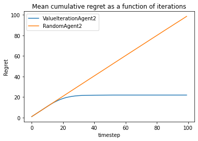

Libraries
~~~~~~~~~

.. code:: ipython3

    import numpy as np
    import pandas as pd
    from rlberry.agents import ValueIterationAgent, AgentWithSimplePolicy
    from rlberry.envs import GridWorld
    from rlberry.manager import AgentManager, evaluate_agents

.. parsed-literal::

    [INFO] No OpenGL_accelerate module loaded: No module named 'OpenGL_accelerate' 

Environment definition
~~~~~~~~~~~~~~~~~~~~~~

A grid world is a simple environment with finite states and actions, on
which we can test simple algorithms. \* The reward function can be
accessed by: env.R[state, action] \* And the transitions: env.P[state,
action, next_state]

.. code:: ipython3

    env_ctor = GridWorld
    env_kwargs =dict(nrows=3, ncols=10,
                    reward_at = {(1,1):0.1, (2, 9):1.0},
                    walls=((1,4),(2,4), (1,5)),
                    success_probability=0.7)
    env = env_ctor(**env_kwargs)

As an indication :

-  nrows: number of rows
-  ncols: number of columns
-  reward_at: definition of the reward function
-  walls: position of the walls
-  success_probability: probability of moving in the chosen direction

Agents definition
~~~~~~~~~~~~~~~~~

We will compare a RandomAgent (which play random action) to a
ValueIterationAgent. Our goal is then to assess the performance of the
two algorithms.

.. code:: ipython3

    # Create random agent as a baseline
    class RandomAgent(AgentWithSimplePolicy):
        name = 'RandomAgent'
        def __init__(self, env, **kwargs):
            AgentWithSimplePolicy.__init__(self, env, **kwargs)
    
        def fit(self, budget=None, **kwargs):
            pass
    
        def policy(self, observation):
            return self.env.action_space.sample()
        
    # We will compare this agent to V
    
    
    # Define parameters
    vi_params = {'gamma':0.1, 'epsilon':1e-3}

Comparisons
-----------

Comparison of expected rewards.
~~~~~~~~~~~~~~~~~~~~~~~~~~~~~~~

We want to assess the expected reward of our agents at a horizon of
(say) :math:`T=20`.

To do that we use 10 Monte-Carlo simulations, i.e. we do the experiment
10 times for each agent and at the end we take the mean of the 10
obtained reward.

This gives us 1 value per agent. We do this 10 times (so 10 times 10
equal 100 simulations) in order to have an idea of the variability of
our estimation.

.. code:: ipython3

    # Create AgentManager to fit 4 agents using 1 job
    vi_stats = AgentManager(
        ValueIterationAgent,
        (env_ctor, env_kwargs),
        fit_budget=0,
        eval_kwargs=dict(eval_horizon=20,n_simimulations=10),
        init_kwargs=vi_params,
        n_fit=1)
    vi_stats.fit()
    
    # Create AgentManager for baseline
    baseline_stats = AgentManager(
        RandomAgent,
        (env_ctor, env_kwargs),
        fit_budget=0,
        eval_kwargs=dict(eval_horizon=20,n_simimulations=10),
        n_fit=1)
    baseline_stats.fit()

.. parsed-literal::

    [INFO] Running AgentManager fit() for ValueIteration...  
    [INFO] ... trained! 
    [INFO] Running AgentManager fit() for RandomAgent...  
    [INFO] ... trained! 

.. code:: ipython3

    output = evaluate_agents([vi_stats, baseline_stats], n_simulations=10, plot=True)

.. parsed-literal::

    [INFO] Evaluating ValueIteration... 
    [INFO] [eval]... simulation 1/10 
    [INFO] [eval]... simulation 2/10 
    [INFO] [eval]... simulation 3/10 
    [INFO] [eval]... simulation 4/10 
    [INFO] [eval]... simulation 5/10 
    [INFO] [eval]... simulation 6/10 
    [INFO] [eval]... simulation 7/10 
    [INFO] [eval]... simulation 8/10 
    [INFO] [eval]... simulation 9/10 
    [INFO] [eval]... simulation 10/10 
    [INFO] Evaluating RandomAgent... 
    [INFO] [eval]... simulation 1/10 
    [INFO] [eval]... simulation 2/10 
    [INFO] [eval]... simulation 3/10 
    [INFO] [eval]... simulation 4/10 
    [INFO] [eval]... simulation 5/10 
    [INFO] [eval]... simulation 6/10 
    [INFO] [eval]... simulation 7/10 
    [INFO] [eval]... simulation 8/10 
    [INFO] [eval]... simulation 9/10 
    [INFO] [eval]... simulation 10/10 

.. image:: output_11_1.png

Comparison of cumulative regret as iterations increase
------------------------------------------------------

To get the regret at each iteration, we have to redefine the ``eval``
function of our agents that tells us what evaluation is returned. The
default is the final reward, we want to retreive all the rewards, an
array

.. code:: ipython3

    class RandomAgent2(RandomAgent):
        name = 'RandomAgent2'
        def __init__(self, env, **kwargs):
            super().__init__(env, **kwargs)
        
        def eval(self,
                 eval_horizon=10 ** 5,
                 **kwargs):
            del kwargs  # unused
            episode_regret = np.zeros(eval_horizon)
            observation,info = self.eval_env.reset()
            for tt in range(eval_horizon):
                action = self.policy(observation)
                observation, reward, terminated, truncated, info = self.eval_env.step(action)
                done = terminated or truncated
                episode_regret[tt] = 1-reward # Optimal reward is 1
            return episode_regret
    
    
    class ValueIterationAgent2(ValueIterationAgent):
        name = 'ValueIterationAgent2'
        def __init__(self, env, gamma=0.95, horizon=None, epsilon=1e-6, **kwargs):
            super().__init__( env, gamma=0.95, horizon=None, epsilon=1e-6, **kwargs)
        
        def eval(self,
                 eval_horizon=10 ** 5,
                 gamma=1,
                 **kwargs):
            del kwargs  # unused
            episode_regret = np.zeros(eval_horizon)
            observation,info = self.eval_env.reset()
            for tt in range(eval_horizon):
                action = self.policy(observation)
                observation, reward, terminated, truncated, info = self.eval_env.step(action)
                done = terminated or truncated
                episode_regret[tt] = 1-reward # Optimal reward is 1
    
            return episode_regret

Then, we do the Monte-Carlo simulations. This time, we directly do 100
simulations and we don’t need the additional 10 simulations because we
won’t compare the expected regret on several runs (i.e. we won’t assess
the variability of our estimation).

.. code:: ipython3

    # Create AgentManager to fit 4 agents using 1 job
    vi_stats = AgentManager(
        ValueIterationAgent2,
        (env_ctor, env_kwargs),
        fit_budget=1,
        eval_kwargs=dict(eval_horizon=100),
        init_kwargs=vi_params,
        n_fit=4)
    vi_stats.fit()
    
    # Create AgentManager for baseline
    baseline_stats = AgentManager(
        RandomAgent2,
        (env_ctor, env_kwargs),
        fit_budget=1,
        eval_kwargs=dict(eval_horizon=100),
        n_fit=1)
    baseline_stats.fit()

.. parsed-literal::

    [INFO] Running AgentManager fit() for ValueIterationAgent2...  
    [INFO] ... trained! 
    [INFO] Running AgentManager fit() for RandomAgent2...  
    [INFO] ... trained! 

.. code:: ipython3

    output = evaluate_agents([vi_stats, baseline_stats], n_simulations=100, plot=False)

.. parsed-literal::

    [INFO] Evaluating ValueIterationAgent2... 
    [INFO] [eval]... simulation 1/100 
    [INFO] [eval]... simulation 2/100 
    [INFO] [eval]... simulation 3/100 
    [INFO] [eval]... simulation 4/100 
    [INFO] [eval]... simulation 5/100 
    [INFO] [eval]... simulation 6/100 
    [INFO] [eval]... simulation 7/100 
    [INFO] [eval]... simulation 8/100 
    [INFO] [eval]... simulation 9/100 
    [INFO] [eval]... simulation 10/100 
    [INFO] [eval]... simulation 11/100 
    [INFO] [eval]... simulation 12/100 
    [INFO] [eval]... simulation 13/100 
    [INFO] [eval]... simulation 14/100 
    [INFO] [eval]... simulation 15/100 
    [INFO] [eval]... simulation 16/100 
    [INFO] [eval]... simulation 17/100 
    [INFO] [eval]... simulation 18/100 
    [INFO] [eval]... simulation 19/100 
    [INFO] [eval]... simulation 20/100 
    [INFO] [eval]... simulation 21/100 
    [INFO] [eval]... simulation 22/100 
    [INFO] [eval]... simulation 23/100 
    [INFO] [eval]... simulation 24/100 
    [INFO] [eval]... simulation 25/100 
    [INFO] [eval]... simulation 26/100 
    [INFO] [eval]... simulation 27/100 
    [INFO] [eval]... simulation 28/100 
    [INFO] [eval]... simulation 29/100 
    [INFO] [eval]... simulation 30/100 
    [INFO] [eval]... simulation 31/100 
    [INFO] [eval]... simulation 32/100 
    [INFO] [eval]... simulation 33/100 
    [INFO] [eval]... simulation 34/100 
    [INFO] [eval]... simulation 35/100 
    [INFO] [eval]... simulation 36/100 
    [INFO] [eval]... simulation 37/100 
    [INFO] [eval]... simulation 38/100 
    [INFO] [eval]... simulation 39/100 
    [INFO] [eval]... simulation 40/100 
    [INFO] [eval]... simulation 41/100 
    [INFO] [eval]... simulation 42/100 
    [INFO] [eval]... simulation 43/100 
    [INFO] [eval]... simulation 44/100 
    [INFO] [eval]... simulation 45/100 
    [INFO] [eval]... simulation 46/100 
    [INFO] [eval]... simulation 47/100 
    [INFO] [eval]... simulation 48/100 
    [INFO] [eval]... simulation 49/100 
    [INFO] [eval]... simulation 50/100 
    [INFO] [eval]... simulation 51/100 
    [INFO] [eval]... simulation 52/100 
    [INFO] [eval]... simulation 53/100 
    [INFO] [eval]... simulation 54/100 
    [INFO] [eval]... simulation 55/100 
    [INFO] [eval]... simulation 56/100 
    [INFO] [eval]... simulation 57/100 
    [INFO] [eval]... simulation 58/100 
    [INFO] [eval]... simulation 59/100 
    [INFO] [eval]... simulation 60/100 
    [INFO] [eval]... simulation 61/100 
    [INFO] [eval]... simulation 62/100 
    [INFO] [eval]... simulation 63/100 
    [INFO] [eval]... simulation 64/100 
    [INFO] [eval]... simulation 65/100 
    [INFO] [eval]... simulation 66/100 
    [INFO] [eval]... simulation 67/100 
    [INFO] [eval]... simulation 68/100 
    [INFO] [eval]... simulation 69/100 
    [INFO] [eval]... simulation 70/100 
    [INFO] [eval]... simulation 71/100 
    [INFO] [eval]... simulation 72/100 
    [INFO] [eval]... simulation 73/100 
    [INFO] [eval]... simulation 74/100 
    [INFO] [eval]... simulation 75/100 
    [INFO] [eval]... simulation 76/100 
    [INFO] [eval]... simulation 77/100 
    [INFO] [eval]... simulation 78/100 
    [INFO] [eval]... simulation 79/100 
    [INFO] [eval]... simulation 80/100 
    [INFO] [eval]... simulation 81/100 
    [INFO] [eval]... simulation 82/100 
    [INFO] [eval]... simulation 83/100 
    [INFO] [eval]... simulation 84/100 
    [INFO] [eval]... simulation 85/100 
    [INFO] [eval]... simulation 86/100 
    [INFO] [eval]... simulation 87/100 
    [INFO] [eval]... simulation 88/100 
    [INFO] [eval]... simulation 89/100 
    [INFO] [eval]... simulation 90/100 
    [INFO] [eval]... simulation 91/100 
    [INFO] [eval]... simulation 92/100 
    [INFO] [eval]... simulation 93/100 
    [INFO] [eval]... simulation 94/100 
    [INFO] [eval]... simulation 95/100 
    [INFO] [eval]... simulation 96/100 
    [INFO] [eval]... simulation 97/100 
    [INFO] [eval]... simulation 98/100 
    [INFO] [eval]... simulation 99/100 
    [INFO] [eval]... simulation 100/100 
    [INFO] Evaluating RandomAgent2... 
    [INFO] [eval]... simulation 1/100 
    [INFO] [eval]... simulation 2/100 
    [INFO] [eval]... simulation 3/100 
    [INFO] [eval]... simulation 4/100 
    [INFO] [eval]... simulation 5/100 
    [INFO] [eval]... simulation 6/100 
    [INFO] [eval]... simulation 7/100 
    [INFO] [eval]... simulation 8/100 
    [INFO] [eval]... simulation 9/100 
    [INFO] [eval]... simulation 10/100 
    [INFO] [eval]... simulation 11/100 
    [INFO] [eval]... simulation 12/100 
    [INFO] [eval]... simulation 13/100 
    [INFO] [eval]... simulation 14/100 
    [INFO] [eval]... simulation 15/100 
    [INFO] [eval]... simulation 16/100 
    [INFO] [eval]... simulation 17/100 
    [INFO] [eval]... simulation 18/100 
    [INFO] [eval]... simulation 19/100 
    [INFO] [eval]... simulation 20/100 
    [INFO] [eval]... simulation 21/100 
    [INFO] [eval]... simulation 22/100 
    [INFO] [eval]... simulation 23/100 
    [INFO] [eval]... simulation 24/100 
    [INFO] [eval]... simulation 25/100 
    [INFO] [eval]... simulation 26/100 
    [INFO] [eval]... simulation 27/100 
    [INFO] [eval]... simulation 28/100 
    [INFO] [eval]... simulation 29/100 
    [INFO] [eval]... simulation 30/100 
    [INFO] [eval]... simulation 31/100 
    [INFO] [eval]... simulation 32/100 
    [INFO] [eval]... simulation 33/100 
    [INFO] [eval]... simulation 34/100 
    [INFO] [eval]... simulation 35/100 
    [INFO] [eval]... simulation 36/100 
    [INFO] [eval]... simulation 37/100 
    [INFO] [eval]... simulation 38/100 
    [INFO] [eval]... simulation 39/100 
    [INFO] [eval]... simulation 40/100 
    [INFO] [eval]... simulation 41/100 
    [INFO] [eval]... simulation 42/100 
    [INFO] [eval]... simulation 43/100 
    [INFO] [eval]... simulation 44/100 
    [INFO] [eval]... simulation 45/100 
    [INFO] [eval]... simulation 46/100 
    [INFO] [eval]... simulation 47/100 
    [INFO] [eval]... simulation 48/100 
    [INFO] [eval]... simulation 49/100 
    [INFO] [eval]... simulation 50/100 
    [INFO] [eval]... simulation 51/100 
    [INFO] [eval]... simulation 52/100 
    [INFO] [eval]... simulation 53/100 
    [INFO] [eval]... simulation 54/100 
    [INFO] [eval]... simulation 55/100 
    [INFO] [eval]... simulation 56/100 
    [INFO] [eval]... simulation 57/100 
    [INFO] [eval]... simulation 58/100 
    [INFO] [eval]... simulation 59/100 
    [INFO] [eval]... simulation 60/100 
    [INFO] [eval]... simulation 61/100 
    [INFO] [eval]... simulation 62/100 
    [INFO] [eval]... simulation 63/100 
    [INFO] [eval]... simulation 64/100 
    [INFO] [eval]... simulation 65/100 
    [INFO] [eval]... simulation 66/100 
    [INFO] [eval]... simulation 67/100 
    [INFO] [eval]... simulation 68/100 
    [INFO] [eval]... simulation 69/100 
    [INFO] [eval]... simulation 70/100 
    [INFO] [eval]... simulation 71/100 
    [INFO] [eval]... simulation 72/100 
    [INFO] [eval]... simulation 73/100 
    [INFO] [eval]... simulation 74/100 
    [INFO] [eval]... simulation 75/100 
    [INFO] [eval]... simulation 76/100 
    [INFO] [eval]... simulation 77/100 
    [INFO] [eval]... simulation 78/100 
    [INFO] [eval]... simulation 79/100 
    [INFO] [eval]... simulation 80/100 
    [INFO] [eval]... simulation 81/100 
    [INFO] [eval]... simulation 82/100 
    [INFO] [eval]... simulation 83/100 
    [INFO] [eval]... simulation 84/100 
    [INFO] [eval]... simulation 85/100 
    [INFO] [eval]... simulation 86/100 
    [INFO] [eval]... simulation 87/100 
    [INFO] [eval]... simulation 88/100 
    [INFO] [eval]... simulation 89/100 
    [INFO] [eval]... simulation 90/100 
    [INFO] [eval]... simulation 91/100 
    [INFO] [eval]... simulation 92/100 
    [INFO] [eval]... simulation 93/100 
    [INFO] [eval]... simulation 94/100 
    [INFO] [eval]... simulation 95/100 
    [INFO] [eval]... simulation 96/100 
    [INFO] [eval]... simulation 97/100 
    [INFO] [eval]... simulation 98/100 
    [INFO] [eval]... simulation 99/100 
    [INFO] [eval]... simulation 100/100 

.. code:: ipython3

    regret = pd.DataFrame(np.array([np.array(output[agent].values.tolist()).cumsum(axis=1).mean(axis=0) for agent in output.columns]).T, columns=output.columns)

.. code:: ipython3

    regret.plot(xlabel = 'timestep', ylabel = 'Regret', title="Mean cumulative regret as a function of iterations")

.. parsed-literal::

    <AxesSubplot:title={'center':'Mean cumulative regret as a function of iterations'}, xlabel='timestep', ylabel='Regret'>

The regret of the Random agent is linear, and the ValueIteration agent
has a sub-linear regret, it seems that it takes around 20 iterations to
get to the intended target.
