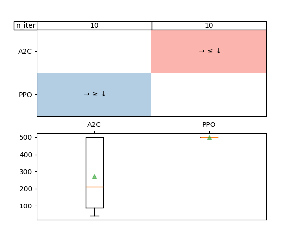

(adastop_userguide)=


# AdaStop


## Hypothesis testing to compare RL agents

AdaStop is a Sequential testing for efficient and reliable comparison of stochastic algorithms first introduced in <https://arxiv.org/abs/2306.10882>.

This section explains how to use the AdaStop algorithm in rlberry. AdaStop implements a sequential statistical test using group sequential permutation test and is especially adapted to multiple testing with very small sample size. The main library for AdaStop is in <https://github.com/TimotheeMathieu/adastop> but for comparison of RL agents, it is easier to use rlberry bindings.

We use AdaStop in particular to to adaptively choose the number of training necessary to get a statistically significant decision on a comparison of algorithms. The rationale is that when the returns of some experiment in computer science is stochastic, it becomes necessary to make the same experiment several time in order to have a viable comparison of the algorithms and be able to rank them with a theoretically controlled family-wise error rate. Adastop allows us to choose the number of repetition adaptively to stop collecting data as soon as possible. Please note, that what we call here algorithm is really a certain implementation of an algorithm.


## Comparison of A2C and PPO from stable-baselines3

Below, we compare A2C and PPO agents from stable-baselines3 on Acrobot environment. We limit the maximum number of trainings for each agent to $5\times 5 = 25$, using $5$ batches of size $5$. We ask that the resulting test has a level of $99\%$ (i.e. the probability to wrongly say that the agents are different is $1\%$).

```python
from rlberry.envs import gym_make
from stable_baselines3 import A2C, PPO
from rlberry.agents.stable_baselines import StableBaselinesAgent
from rlberry.manager import AdastopComparator

env_ctor, env_kwargs = gym_make, dict(id="CartPole-v1")

managers = [
    {
        "agent_class": StableBaselinesAgent,
        "train_env": (env_ctor, env_kwargs),
        "fit_budget": 5e4,
        "agent_name": "A2C",
        "init_kwargs": {"algo_cls": A2C, "policy": "MlpPolicy", "verbose": 1},
    },
    {
        "agent_class": StableBaselinesAgent,
        "train_env": (env_ctor, env_kwargs),
        "agent_name": "PPO",
        "fit_budget": 5e4,
        "init_kwargs": {"algo_cls": PPO, "policy": "MlpPolicy", "verbose": 1},
    },
]

comparator = AdastopComparator(n=5, K=5, alpha=0.01)
comparator.compare(managers)
print(comparator.managers_paths)
```

## Result visualisation

The results of the comparison can be obtained either in text format using `print_results`

```python
comparator.print_results()
```

The result is found using 10 scores for each agent:
```
Number of scores used for each agent:
A2C:10
PPO:10

Mean of scores of each agent:
A2C:271.17600000000004
PPO:500.0

Decision for each comparison:
A2C vs PPO:smaller
```


or with a plot using `plot_results`

```python
comparator.plot_results()
```



The boxplots in the plot represent the distribution of the scores gathered for each agent. The table on the top of the figure represent the decisions taken by the test: larger, smaller or equal.
