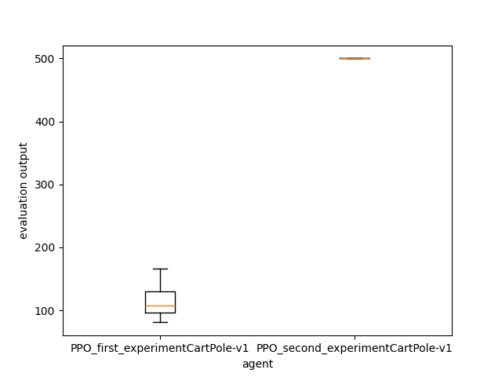

(experimentManager_page)=

# How to use the ExperimentManager

It's the element that allow you to make your experiments on [Agent](agent_page) and [Environment](environment_page).
You can use it to train, optimize hyperparameters, evaluate, compare, and gather statistics about your agent on a specific environment. You can find the API doc [here](rlberry.manager.ExperimentManager).
It's not the only solution, but it's the compact (and recommended) way of experiment with an agent.

## Create your experiment

```python
from rlberry.envs import gym_make
from rlberry.agents.torch import PPOAgent
from rlberry.manager import ExperimentManager, evaluate_agents


env_id = "CartPole-v1"        #Id of the environment

env_ctor = gym_make           #constructor for the env
env_kwargs = dict(id=env_id)  #give the id of the env inside the kwargs


first_experiment = ExperimentManager(
    PPOAgent,     #Agent Class
    (env_ctor, env_kwargs),   #Environment as Tuple(constructor,kwargs)
    fit_budget=int(100),    #Budget used to call our agent "fit()"
    eval_kwargs=dict(eval_horizon=1000),  #Arguments required to call rlberry.agents.agent.Agent.eval().
    n_fit=1,  #Number of agent instances to fit.
    agent_name="PPO_first_experiment" + env_id,   #Name of the agent
    seed=42,  
)

first_experiment.fit()    

output = evaluate_agents([first_experiment], n_simulations=5, plot=False)    #evaluate the experiment on 5 simulations
print(output)
```

```none
[INFO] 14:26: Running ExperimentManager fit() for PPO_first_experimentCartPole-v1 with n_fit = 1 and max_workers = None. 
[INFO] 14:26: ... trained! 
[INFO] 14:26: Evaluating PPO_first_experimentCartPole-v1... 
[INFO] Evaluation:.....  Evaluation finished 

   PPO_first_experimentCartPole-v1
0                             15.0
1                             18.4
2                             21.4
3                             22.3
4                             23.0
```
</br>


## Compare with other agent
Now you can compare this agent with another one. Here, we gonna compare it with the same agent, but with a bigger fit budget, and some fine tuning.


<span>&#9888;</span> **warning :** add this code after the previous one. <span>&#9888;</span>
```python
second_experiment = ExperimentManager(
    PPOAgent,     #Agent Class
    (env_ctor, env_kwargs),   #Environment as Tuple(constructor,kwargs)
    fit_budget=int(10000),    #Budget used to call our agent "fit()"
    init_kwargs=dict(batch_size=24, n_steps=96, device="cpu"),  #Arguments for the Agent’s constructor.
    eval_kwargs=dict(eval_horizon=1000),  #Arguments required to call rlberry.agents.agent.Agent.eval().
    n_fit=1,  #Number of agent instances to fit.
    agent_name="PPO_second_experiment" + env_id,   #Name of our agent (for saving/printing)
    seed=42,  
)

second_experiment.fit()    

output = evaluate_agents([first_experiment,second_experiment], n_simulations=5, plot=True)    #evaluate the 2 experiments on 5 simulations
print(output)
```

```none
[INFO] 14:39: Running ExperimentManager fit() for PPO_second_experimentCartPole-v1 with n_fit = 1 and max_workers = None. 
[INFO] 14:39: [PPO_second_experimentCartPole-v1[worker: 0]] | max_global_step = 2496 | fit/policy_loss = -0.0443466454744339 | fit/value_loss = 33.09639358520508 | fit/entropy_loss = 0.6301112174987793 | fit/approx_kl = 0.0029671359807252884 | fit/clipfrac = 0.0 | fit/explained_variance = 0.4449042081832886 | fit/learning_rate = 0.0003 |  
[INFO] 14:39: [PPO_second_experimentCartPole-v1[worker: 0]] | max_global_step = 5472 | fit/policy_loss = -0.020021788775920868 | fit/value_loss = 171.70037841796875 | fit/entropy_loss = 0.5415757298469543 | fit/approx_kl = 0.001022467389702797 | fit/clipfrac = 0.0 | fit/explained_variance = 0.1336498260498047 | fit/learning_rate = 0.0003 |  
[INFO] 14:39: [PPO_second_experimentCartPole-v1[worker: 0]] | max_global_step = 8256 | fit/policy_loss = -0.016511857509613037 | fit/value_loss = 199.02989196777344 | fit/entropy_loss = 0.5490894317626953 | fit/approx_kl = 0.022175027057528496 | fit/clipfrac = 0.27083333395421505 | fit/explained_variance = 0.19932276010513306 | fit/learning_rate = 0.0003 |  
[INFO] 14:39: ... trained! 
[INFO] 14:39: Evaluating PPO_first_experimentCartPole-v1... 
[INFO] Evaluation:.....  Evaluation finished 
[INFO] 14:39: Evaluating PPO_second_experimentCartPole-v1... 
[INFO] Evaluation:.....  Evaluation finished 

   PPO_first_experimentCartPole-v1  PPO_second_experimentCartPole-v1
0                             20.6                             200.6
1                             20.5                             286.7
2                             18.9                             238.6
3                             18.2                             248.2
4                             17.7                             271.9
```
As we can see in the output or in the following image, the second agent succeed better.

{.align-center}

</br>

## Output the video
If you want to see the output video of the trained Agent, you need to use the RecordVideo wrapper. As ExperimentManager use tuple for env parameter, you need to give the constructor with the wrapper. To do that, you can use [PipelineEnv](rlberry.envs.PipelineEnv) as constructor, and add the wrapper + the env information in its kwargs. 

<span>&#9888;</span> **warning :** You have to do it on the eval environment, or you may have videos during the fit of your Agent. <span>&#9888;</span>

```python
env_id = "CartPole-v1"
env_ctor = gym_make             #constructor for training env
env_kwargs = dict(id=env_id)    #kwars for training env

eval_env_ctor = PipelineEnv   #constructor for eval env
eval_env_kwargs = {           #kwars for eval env (with wrapper)
    "env_ctor": gym_make,
    "env_kwargs": {"id": env_id, "render_mode":"rgb_array"},
    "wrappers": [(RecordVideo,{"video_folder":"./","name_prefix":env_id})]   #list of tuple (class,kwargs)
}

third_experiment = ExperimentManager(
    PPOAgent,     #Agent Class
    (env_ctor, env_kwargs),   #Environment as Tuple(constructor,kwargs)
    fit_budget=int(10000),    #Budget used to call our agent "fit()"
    eval_env = (eval_env_ctor, eval_env_kwargs),    #Evaluation environment as tuple
    init_kwargs=dict(batch_size=24, n_steps=96, device="cpu"),  #settings for the Agent
    eval_kwargs=dict(eval_horizon=1000),  #Arguments required to call rlberry.agents.agent.Agent.eval().
    n_fit=1,  #Number of agent instances to fit.
    agent_name="PPO_third_experiment" + env_id,   #Name of the agent
    seed=42,  
)

third_experiment.fit()    

output3 = evaluate_agents([third_experiment], n_simulations=15, plot=False)    #evaluate the experiment on 5 simulations
print(output3)

```


```None
[INFO] 17:03: Running ExperimentManager fit() for PPO_third_experimentCartPole-v1 with n_fit = 1 and max_workers = None. 
[INFO] 17:03: [PPO_third_experimentCartPole-v1[worker: 0]] | max_global_step = 1536 | fit/policy_loss = -0.0001924981625052169 | fit/value_loss = 34.07163619995117 | fit/entropy_loss = 0.6320618987083435 | fit/approx_kl = 0.00042163082980550826 | fit/clipfrac = 0.0 | fit/explained_variance = -0.05607199668884277 | fit/learning_rate = 0.0003 |  
[INFO] 17:03: [PPO_third_experimentCartPole-v1[worker: 0]] | max_global_step = 3744 | fit/policy_loss = -0.02924121916294098 | fit/value_loss = 0.8705029487609863 | fit/entropy_loss = 0.6485489010810852 | fit/approx_kl = 0.0006057650898583233 | fit/clipfrac = 0.0 | fit/explained_variance = 0.9505079835653305 | fit/learning_rate = 0.0003 |  
[INFO] 17:03: [PPO_third_experimentCartPole-v1[worker: 0]] | max_global_step = 5856 | fit/policy_loss = -0.008760576136410236 | fit/value_loss = 2.063389778137207 | fit/entropy_loss = 0.5526289343833923 | fit/approx_kl = 0.017247432842850685 | fit/clipfrac = 0.08645833283662796 | fit/explained_variance = 0.9867914840579033 | fit/learning_rate = 0.0003 |  
[INFO] 17:03: [PPO_third_experimentCartPole-v1[worker: 0]] | max_global_step = 8256 | fit/policy_loss = -0.016511857509613037 | fit/value_loss = 199.02989196777344 | fit/entropy_loss = 0.5490894317626953 | fit/approx_kl = 0.022175027057528496 | fit/clipfrac = 0.27083333395421505 | fit/explained_variance = 0.19932276010513306 | fit/learning_rate = 0.0003 |  
[INFO] 09:45: Evaluating PPO_third_experimentCartPole-v1... 
[INFO] Evaluation:Moviepy - Building video <yourPath>/CartPole-v1-episode-0.mp4.
Moviepy - Writing video <yourPath>CartPole-v1-episode-0.mp4

Moviepy - Done !                                                                                                                          
Moviepy - video ready <yourPath>/CartPole-v1-episode-0.mp4
.Moviepy - Building video <yourPath>/CartPole-v1-episode-1.mp4.
Moviepy - Writing video <yourPath>/CartPole-v1-episode-1.mp4

Moviepy - Done !                                                                                                                          
Moviepy - video ready <yourPath>/CartPole-v1-episode-1.mp4
....  Evaluation finished 

   PPO_third_experimentCartPole-v1
0                            175.0
1                            189.0
2                            234.0
3                            146.0
4                            236.0
```

<video controls="controls" style="max-width: 600px;">
   <source src="../../../../_video/user_guide_video/_experimentManager_page_CartPole.mp4" type="video/mp4">
</video>


## Some advanced settings
Now an example with some more settings. (check the [API](rlberry.manager.ExperimentManager) to see all of them)

```python
sfrom rlberry.envs import gym_make
from rlberry.agents.torch import PPOAgent
from rlberry.manager import ExperimentManager, evaluate_agents


env_id = "CartPole-v1"
env_ctor = gym_make
env_kwargs = dict(id=env_id)

fourth_experiment = ExperimentManager(
    PPOAgent,     #Agent Class
    train_env=(env_ctor, env_kwargs),   #Environment to train the Agent
    fit_budget=int(15000),    #Budget used to call our agent "fit()"
    eval_env=(env_ctor, env_kwargs),   #Environment to eval the Agent (here, same as training env)
    init_kwargs=dict(batch_size=24, n_steps=96, device="cpu"),  #Agent setting
    eval_kwargs=dict(eval_horizon=1000),  #Arguments required to call rlberry.agents.agent.Agent.eval().
    agent_name="PPO_second_experiment" + env_id,   #Name of the agent
    n_fit=4,  #Number of agent instances to fit.
    output_dir="./fourth_experiment_results/",  #Directory where to store data.
    parallelization="thread",   #parallelize agent training using threads
    max_workers=2,  #max 2 threads with parallelization
    enable_tensorboard=True,    #enable tensorboard logging
)

fourth_experiment.fit()    

output = evaluate_agents([fourth_experiment], n_simulations=5, plot=False)    #evaluate the experiment on 5 simulations
print(output)

```

```none
[INFO] 10:28: Running ExperimentManager fit() for PPO_second_experimentCartPole-v1 with n_fit = 4 and max_workers = 2. 
[INFO] 10:28: [PPO_second_experimentCartPole-v1[worker: 0]] | max_global_step = 1248 | fit/policy_loss = -0.0046189031563699245 | fit/value_loss = 17.90558624267578 | fit/entropy_loss = 0.6713765263557434 | fit/approx_kl = 0.008433022536337376 | fit/clipfrac = 0.00416666679084301 | fit/explained_variance = -0.027537941932678223 | fit/learning_rate = 0.0003 |  
[INFO] 10:28: [PPO_second_experimentCartPole-v1[worker: 1]] | max_global_step = 1344 | fit/policy_loss = -0.0015951147070154548 | fit/value_loss = 30.366439819335938 | fit/entropy_loss = 0.6787645816802979 | fit/approx_kl = 6.758669769624248e-05 | fit/clipfrac = 0.0 | fit/explained_variance = 0.03739374876022339 | fit/learning_rate = 0.0003 |  
[INFO] 10:29: [PPO_second_experimentCartPole-v1[worker: 0]] | max_global_step = 2784 | fit/policy_loss = 0.0009148915414698422 | fit/value_loss = 29.08318328857422 | fit/entropy_loss = 0.6197206974029541 | fit/approx_kl = 0.01178667601197958 | fit/clipfrac = 0.012499999906867742 | fit/explained_variance = 0.0344814658164978 | fit/learning_rate = 0.0003 |  
[INFO] 10:29: [PPO_second_experimentCartPole-v1[worker: 1]] | max_global_step = 2880 | fit/policy_loss = 0.001672893762588501 | fit/value_loss = 27.00239372253418 | fit/entropy_loss = 0.6320319771766663 | fit/approx_kl = 0.003481858177110553 | fit/clipfrac = 0.0 | fit/explained_variance = 0.15528488159179688 | fit/learning_rate = 0.0003 |  
[INFO] 10:29: [PPO_second_experimentCartPole-v1[worker: 0]] | max_global_step = 4224 | fit/policy_loss = -0.022785374894738197 | fit/value_loss = 91.76630401611328 | fit/entropy_loss = 0.5638656616210938 | fit/approx_kl = 0.0017503012204542756 | fit/clipfrac = 0.0 | fit/explained_variance = -0.7095993757247925 | fit/learning_rate = 0.0003 |  
[INFO] 10:29: [PPO_second_experimentCartPole-v1[worker: 1]] | max_global_step = 4320 | fit/policy_loss = 0.0013483166694641113 | fit/value_loss = 31.31000518798828 | fit/entropy_loss = 0.589007556438446 | fit/approx_kl = 0.015259895473718643 | fit/clipfrac = 0.11979166707023978 | fit/explained_variance = -0.045020341873168945 | fit/learning_rate = 0.0003 |  
[INFO] 10:29: [PPO_second_experimentCartPole-v1[worker: 0]] | max_global_step = 5856 | fit/policy_loss = 0.00605475390329957 | fit/value_loss = 44.3318977355957 | fit/entropy_loss = 0.625015377998352 | fit/approx_kl = 0.00823256652802229 | fit/clipfrac = 0.002083333395421505 | fit/explained_variance = 0.4239630103111267 | fit/learning_rate = 0.0003 |  
[INFO] 10:29: [PPO_second_experimentCartPole-v1[worker: 1]] | max_global_step = 5856 | fit/policy_loss = 0.0038757026195526123 | fit/value_loss = 68.52188873291016 | fit/entropy_loss = 0.5918349027633667 | fit/approx_kl = 0.003220468061044812 | fit/clipfrac = 0.006250000186264515 | fit/explained_variance = -0.18818902969360352 | fit/learning_rate = 0.0003 |  
[INFO] 10:29: [PPO_second_experimentCartPole-v1[worker: 0]] | max_global_step = 7488 | fit/policy_loss = -0.009495516307651997 | fit/value_loss = 101.06624603271484 | fit/entropy_loss = 0.5486583709716797 | fit/approx_kl = 0.003257486969232559 | fit/clipfrac = 0.0 | fit/explained_variance = 0.1193075180053711 | fit/learning_rate = 0.0003 |  
[INFO] 10:29: [PPO_second_experimentCartPole-v1[worker: 1]] | max_global_step = 7488 | fit/policy_loss = -0.008390605449676514 | fit/value_loss = 3.112384080886841 | fit/entropy_loss = 0.5489932894706726 | fit/approx_kl = 0.004215842578560114 | fit/clipfrac = 0.06250000121071934 | fit/explained_variance = 0.9862392572686076 | fit/learning_rate = 0.0003 |  
[INFO] 10:29: [PPO_second_experimentCartPole-v1[worker: 0]] | max_global_step = 9024 | fit/policy_loss = -0.037699855864048004 | fit/value_loss = 7.979381561279297 | fit/entropy_loss = 0.5623810887336731 | fit/approx_kl = 0.004208063241094351 | fit/clipfrac = 0.015625000465661287 | fit/explained_variance = 0.927260547876358 | fit/learning_rate = 0.0003 |  
[INFO] 10:29: [PPO_second_experimentCartPole-v1[worker: 1]] | max_global_step = 9024 | fit/policy_loss = -0.03145790100097656 | fit/value_loss = 136.57496643066406 | fit/entropy_loss = 0.6083818078041077 | fit/approx_kl = 0.00015769463789183646 | fit/clipfrac = 0.0 | fit/explained_variance = 0.020778536796569824 | fit/learning_rate = 0.0003 |  
[INFO] 10:29: [PPO_second_experimentCartPole-v1[worker: 0]] | max_global_step = 10560 | fit/policy_loss = -0.005346258636564016 | fit/value_loss = 45.43724060058594 | fit/entropy_loss = 0.5453484654426575 | fit/approx_kl = 0.0029732866678386927 | fit/clipfrac = 0.0010416666977107526 | fit/explained_variance = 0.5737246572971344 | fit/learning_rate = 0.0003 |  
[INFO] 10:29: [PPO_second_experimentCartPole-v1[worker: 1]] | max_global_step = 10656 | fit/policy_loss = -0.034032005816698074 | fit/value_loss = 8.352469444274902 | fit/entropy_loss = 0.5558638572692871 | fit/approx_kl = 0.00012727950525004417 | fit/clipfrac = 0.0 | fit/explained_variance = 0.9023054912686348 | fit/learning_rate = 0.0003 |  
[INFO] 10:29: [PPO_second_experimentCartPole-v1[worker: 0]] | max_global_step = 12192 | fit/policy_loss = -0.014423723332583904 | fit/value_loss = 4.224886417388916 | fit/entropy_loss = 0.5871571898460388 | fit/approx_kl = 0.00237840972840786 | fit/clipfrac = 0.00833333358168602 | fit/explained_variance = 0.9782726876437664 | fit/learning_rate = 0.0003 |  
[INFO] 10:29: [PPO_second_experimentCartPole-v1[worker: 1]] | max_global_step = 12192 | fit/policy_loss = 0.002156441332772374 | fit/value_loss = 0.6400878429412842 | fit/entropy_loss = 0.5812122821807861 | fit/approx_kl = 0.002348624635487795 | fit/clipfrac = 0.0031250000931322573 | fit/explained_variance = -7.9211273193359375 | fit/learning_rate = 0.0003 |  
[INFO] 10:29: [PPO_second_experimentCartPole-v1[worker: 0]] | max_global_step = 13728 | fit/policy_loss = -0.009624089114367962 | fit/value_loss = 0.2872621715068817 | fit/entropy_loss = 0.5476118922233582 | fit/approx_kl = 0.005943961441516876 | fit/clipfrac = 0.045833333022892477 | fit/explained_variance = -2.098886489868164 | fit/learning_rate = 0.0003 |  
[INFO] 10:29: [PPO_second_experimentCartPole-v1[worker: 1]] | max_global_step = 13824 | fit/policy_loss = -0.002612883923575282 | fit/value_loss = 142.26548767089844 | fit/entropy_loss = 0.5882496237754822 | fit/approx_kl = 0.001458114362321794 | fit/clipfrac = 0.0 | fit/explained_variance = 0.11501973867416382 | fit/learning_rate = 0.0003 |  
[INFO] 10:29: [PPO_second_experimentCartPole-v1[worker: 2]] | max_global_step = 1440 | fit/policy_loss = -0.0015770109603181481 | fit/value_loss = 19.095449447631836 | fit/entropy_loss = 0.6553768515586853 | fit/approx_kl = 0.0036005538422614336 | fit/clipfrac = 0.0 | fit/explained_variance = -0.02544558048248291 | fit/learning_rate = 0.0003 |  
[INFO] 10:29: [PPO_second_experimentCartPole-v1[worker: 3]] | max_global_step = 1440 | fit/policy_loss = 0.010459281504154205 | fit/value_loss = 24.7592716217041 | fit/entropy_loss = 0.6623566746711731 | fit/approx_kl = 0.003298681229352951 | fit/clipfrac = 0.0 | fit/explained_variance = -0.06966197490692139 | fit/learning_rate = 0.0003 |  
[INFO] 10:29: [PPO_second_experimentCartPole-v1[worker: 2]] | max_global_step = 2976 | fit/policy_loss = 0.016300952062010765 | fit/value_loss = 38.56718826293945 | fit/entropy_loss = 0.6324384212493896 | fit/approx_kl = 0.0001397288142470643 | fit/clipfrac = 0.0 | fit/explained_variance = 0.06470108032226562 | fit/learning_rate = 0.0003 |  
[INFO] 10:29: [PPO_second_experimentCartPole-v1[worker: 3]] | max_global_step = 3072 | fit/policy_loss = -0.04757208749651909 | fit/value_loss = 49.06455612182617 | fit/entropy_loss = 0.5877493023872375 | fit/approx_kl = 0.014825299382209778 | fit/clipfrac = 0.05000000027939677 | fit/explained_variance = 0.162692129611969 | fit/learning_rate = 0.0003 |  
[INFO] 10:29: [PPO_second_experimentCartPole-v1[worker: 2]] | max_global_step = 4608 | fit/policy_loss = 0.010635286569595337 | fit/value_loss = 63.65742874145508 | fit/entropy_loss = 0.54666668176651 | fit/approx_kl = 0.014807184226810932 | fit/clipfrac = 0.1291666661389172 | fit/explained_variance = 0.17509007453918457 | fit/learning_rate = 0.0003 |  
[INFO] 10:29: [PPO_second_experimentCartPole-v1[worker: 3]] | max_global_step = 4704 | fit/policy_loss = 0.007104901131242514 | fit/value_loss = 60.899166107177734 | fit/entropy_loss = 0.5803811550140381 | fit/approx_kl = 0.016342414543032646 | fit/clipfrac = 0.10000000083819031 | fit/explained_variance = 0.14491546154022217 | fit/learning_rate = 0.0003 |  
[INFO] 10:29: [PPO_second_experimentCartPole-v1[worker: 2]] | max_global_step = 6240 | fit/policy_loss = -0.017549103125929832 | fit/value_loss = 131.22430419921875 | fit/entropy_loss = 0.5248685479164124 | fit/approx_kl = 0.0007476735045202076 | fit/clipfrac = 0.0 | fit/explained_variance = 0.18155068159103394 | fit/learning_rate = 0.0003 |  
[INFO] 10:29: [PPO_second_experimentCartPole-v1[worker: 3]] | max_global_step = 6336 | fit/policy_loss = -0.009597748517990112 | fit/value_loss = 306.9555358886719 | fit/entropy_loss = 0.5775970220565796 | fit/approx_kl = 0.0005952063947916031 | fit/clipfrac = 0.0 | fit/explained_variance = -0.3066709041595459 | fit/learning_rate = 0.0003 |  
[INFO] 10:29: [PPO_second_experimentCartPole-v1[worker: 2]] | max_global_step = 7872 | fit/policy_loss = -0.0011599212884902954 | fit/value_loss = 0.3407192528247833 | fit/entropy_loss = 0.41181233525276184 | fit/approx_kl = 0.01260202657431364 | fit/clipfrac = 0.19791666492819787 | fit/explained_variance = 0.975825097411871 | fit/learning_rate = 0.0003 |  
[INFO] 10:29: [PPO_second_experimentCartPole-v1[worker: 3]] | max_global_step = 7968 | fit/policy_loss = -0.047126080840826035 | fit/value_loss = 30.541654586791992 | fit/entropy_loss = 0.5876209139823914 | fit/approx_kl = 0.0013518078485503793 | fit/clipfrac = 0.0 | fit/explained_variance = 0.7769163846969604 | fit/learning_rate = 0.0003 |  
[INFO] 10:29: [PPO_second_experimentCartPole-v1[worker: 2]] | max_global_step = 9504 | fit/policy_loss = -0.005419999361038208 | fit/value_loss = 2.6821603775024414 | fit/entropy_loss = 0.4786674976348877 | fit/approx_kl = 0.002310350304469466 | fit/clipfrac = 0.0 | fit/explained_variance = 0.5584505200386047 | fit/learning_rate = 0.0003 |  
[INFO] 10:29: [PPO_second_experimentCartPole-v1[worker: 3]] | max_global_step = 9600 | fit/policy_loss = -0.0188402459025383 | fit/value_loss = 175.68919372558594 | fit/entropy_loss = 0.5457869172096252 | fit/approx_kl = 0.0003522926417645067 | fit/clipfrac = 0.0 | fit/explained_variance = 0.37716150283813477 | fit/learning_rate = 0.0003 |  
[INFO] 10:29: [PPO_second_experimentCartPole-v1[worker: 2]] | max_global_step = 11136 | fit/policy_loss = 0.002097398042678833 | fit/value_loss = 0.04328225180506706 | fit/entropy_loss = 0.520216166973114 | fit/approx_kl = 2.282687091792468e-05 | fit/clipfrac = 0.002083333395421505 | fit/explained_variance = 0.9905285472050309 | fit/learning_rate = 0.0003 |  
[INFO] 10:29: [PPO_second_experimentCartPole-v1[worker: 3]] | max_global_step = 11232 | fit/policy_loss = -0.02607026696205139 | fit/value_loss = 0.9695928692817688 | fit/entropy_loss = 0.544611930847168 | fit/approx_kl = 0.0014795692404732108 | fit/clipfrac = 0.008333333488553762 | fit/explained_variance = 0.775581106543541 | fit/learning_rate = 0.0003 |  
[INFO] 10:29: [PPO_second_experimentCartPole-v1[worker: 2]] | max_global_step = 12768 | fit/policy_loss = -0.00431543355807662 | fit/value_loss = 0.1664377897977829 | fit/entropy_loss = 0.5166257619857788 | fit/approx_kl = 0.01913692243397236 | fit/clipfrac = 0.2750000006519258 | fit/explained_variance = 0.950390450656414 | fit/learning_rate = 0.0003 |  
[INFO] 10:29: [PPO_second_experimentCartPole-v1[worker: 3]] | max_global_step = 12864 | fit/policy_loss = -0.01600167714059353 | fit/value_loss = 1.0876649618148804 | fit/entropy_loss = 0.5791975259780884 | fit/approx_kl = 0.015078354626893997 | fit/clipfrac = 0.05416666679084301 | fit/explained_variance = 0.957294762134552 | fit/learning_rate = 0.0003 |  
[INFO] 10:29: [PPO_second_experimentCartPole-v1[worker: 2]] | max_global_step = 14208 | fit/policy_loss = -0.007962663657963276 | fit/value_loss = 0.4722827970981598 | fit/entropy_loss = 0.5429236888885498 | fit/approx_kl = 0.011440296657383442 | fit/clipfrac = 0.029166666604578496 | fit/explained_variance = -2.395857334136963 | fit/learning_rate = 0.0003 |  
[INFO] 10:29: [PPO_second_experimentCartPole-v1[worker: 3]] | max_global_step = 14304 | fit/policy_loss = -0.00023897241044323891 | fit/value_loss = 0.37554287910461426 | fit/entropy_loss = 0.5310923457145691 | fit/approx_kl = 0.0071893795393407345 | fit/clipfrac = 0.18125000046566128 | fit/explained_variance = -2.975414991378784 | fit/learning_rate = 0.0003 |  
[INFO] 10:29: ... trained! 
[INFO] 10:29: Evaluating PPO_second_experimentCartPole-v1... 
[INFO] Evaluation:.....  Evaluation finished 

   PPO_second_experimentCartPole-v1
0                             164.0
1                             142.0
2                             180.0
3                             500.0
4                             500.0
```

</br>

- In the output you can see the learning of the workers 0 and 1 first, then 2 and 3 (4 fit, but max 2 threads with parallelization).
- You can check the tensorboard logging with `tensorboard --logdir <path to your output_dir>`. 