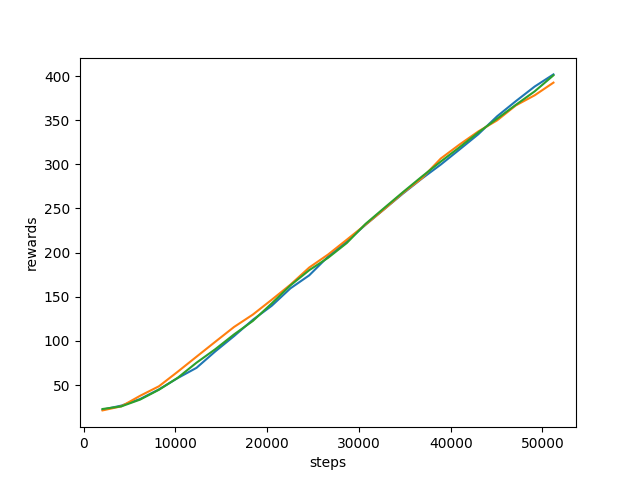

(export_training_data)=

# How to export data about training?


## how to extract data from the WriterData?
rlberry have tools to display information about the training of the agent. Some of these tool are visible on the [visualization page](visu_userguide) (from User Guide).

But maybe you have your favorite tool, and want to use it.
Rlberry allows training data to be exported as dataframe, to be used with other tools.

To get these data, use the {mod}`rlberry.manager.read_writer_data` function.

Here is the same code from the [visualization page](visu_userguide):

```python
from rlberry.envs import gym_make
from stable_baselines3 import PPO
from rlberry.agents.stable_baselines import StableBaselinesAgent
from rlberry.manager import ExperimentManager, plot_writer_data, read_writer_data
import matplotlib.pyplot as plt

env_ctor, env_kwargs = gym_make, dict(id="CartPole-v1")

manager = ExperimentManager(
    StableBaselinesAgent,
    (env_ctor, env_kwargs),
    agent_name="PPO",
    fit_budget=5e4,
    init_kwargs={"algo_cls": PPO, "policy": "MlpPolicy", "verbose": 0},
    n_fit=3,
)

manager.fit()
```

```none
[INFO] 15:58: Running ExperimentManager fit() for PPO with n_fit = 3 and max_workers = None.
[INFO] 15:58:                                 agent_name  worker  time/iterations  max_global_step
                                                 PPO        1           1               2048
[INFO] 15:58:                                 agent_name  worker  time/iterations  max_global_step
                                                 PPO        2           1               2048
[INFO] 15:58:                                 agent_name  worker  time/iterations  max_global_step
                                                 PPO        0           1               2048
[INFO] 15:58: [PPO[worker: 1]] | max_global_step = 4096 | time/iterations = 1 | rollout/ep_rew_mean = 23.569767441860463 | rollout/ep_len_mean = 23.569767441860463 | time/fps = 591 | time/time_elapsed = 3 | time/total_timesteps = 2048 | train/learning_rate = 0.0003 |
[INFO] 15:58: [PPO[worker: 2]] | max_global_step = 4096 | time/iterations = 1 | rollout/ep_rew_mean = 21.903225806451612 | rollout/ep_len_mean = 21.903225806451612 | time/fps = 567 | time/time_elapsed = 3 | time/total_timesteps = 2048 | train/learning_rate = 0.0003 |
[INFO] 15:58: [PPO[worker: 0]] | max_global_step = 4096 | time/iterations = 1 | rollout/ep_rew_mean = 23.49425287356322 | rollout/ep_len_mean = 23.49425287356322 | time/fps = 557 | time/time_elapsed = 3 | time/total_timesteps = 2048 | train/learning_rate = 0.0003 |
[INFO] 15:59: [PPO[worker: 1]] | max_global_step = 6144 | time/iterations = 2 | rollout/ep_rew_mean = 26.94 | rollout/ep_len_mean = 26.94 | time/fps = 437 | time/time_elapsed = 9 | time/total_timesteps = 4096 | train/learning_rate = 0.0003 | train/entropy_loss = -0.6862980721518397 | train/policy_gradient_loss = -0.016145382329705173 | train/value_loss = 57.95402302145958 | train/approx_kl = 0.009136519394814968 | train/clip_fraction = 0.1068359375 | train/loss = 6.268213748931885 | train/explained_variance = 0.00011879205703735352 | train/n_updates = 10 | train/clip_range = 0.2 |
[INFO] 15:59: [PPO[worker: 2]] | max_global_step = 6144 | time/iterations = 2 | rollout/ep_rew_mean = 26.84 | rollout/ep_len_mean = 26.84 | time/fps = 429 | time/time_elapsed = 9 | time/total_timesteps = 4096 | train/learning_rate = 0.0003 | train/entropy_loss = -0.6861314654350281 | train/policy_gradient_loss = -0.016842093877494337 | train/value_loss = 50.17323541939258 | train/approx_kl = 0.007978597655892372 | train/clip_fraction = 0.1025390625 | train/loss = 5.8147406578063965 | train/explained_variance = 0.0003063678741455078 | train/n_updates = 10 | train/clip_range = 0.2 |
[INFO] 15:59: [PPO[worker: 0]] | max_global_step = 6144 | time/iterations = 2 | rollout/ep_rew_mean = 28.75 | rollout/ep_len_mean = 28.75 | time/fps = 426 | time/time_elapsed = 9 | time/total_timesteps = 4096 | train/learning_rate = 0.0003 | train/entropy_loss = -0.6855484075844288 | train/policy_gradient_loss = -0.015410382760455832 | train/value_loss = 61.32087602615356 | train/approx_kl = 0.008056383579969406 | train/clip_fraction = 0.105224609375 | train/loss = 10.251166343688965 | train/explained_variance = 0.012730419635772705 | train/n_updates = 10 | train/clip_range = 0.2 |
[INFO] 15:59: [PPO[worker: 1]] | max_global_step = 8192 | time/iterations = 3 | rollout/ep_rew_mean = 36.85 | rollout/ep_len_mean = 36.85 | time/fps = 409 | time/time_elapsed = 14 | time/total_timesteps = 6144 | train/learning_rate = 0.0003 | train/entropy_loss = -0.6685062969103456 | train/policy_gradient_loss = -0.014946110408345703 | train/value_loss = 39.33342697024345 | train/approx_kl = 0.008881180547177792 | train/clip_fraction = 0.060693359375 | train/loss = 11.630510330200195 | train/explained_variance = 0.1108359694480896 | train/n_updates = 20 | train/clip_range = 0.2 |
[INFO] 15:59: [PPO[worker: 2]] | max_global_step = 8192 | time/iterations = 3 | rollout/ep_rew_mean = 37.18 | rollout/ep_len_mean = 37.18 | time/fps = 403 | time/time_elapsed = 15 | time/total_timesteps = 6144 | train/learning_rate = 0.0003 | train/entropy_loss = -0.6661150485277176 | train/policy_gradient_loss = -0.013149463082663715 | train/value_loss = 38.683698976039885 | train/approx_kl = 0.007977155968546867 | train/clip_fraction = 0.043798828125 | train/loss = 13.9081449508667 | train/explained_variance = 0.05941134691238403 | train/n_updates = 20 | train/clip_range = 0.2 |
[INFO] 15:59: [PPO[worker: 0]] | max_global_step = 8192 | time/iterations = 3 | rollout/ep_rew_mean = 37.65 | rollout/ep_len_mean = 37.65 | time/fps = 402 | time/time_elapsed = 15 | time/total_timesteps = 6144 | train/learning_rate = 0.0003 | train/entropy_loss = -0.6675648905336857 | train/policy_gradient_loss = -0.01585175626023556 | train/value_loss = 39.83039126396179 | train/approx_kl = 0.008422331884503365 | train/clip_fraction = 0.05068359375 | train/loss = 18.283363342285156 | train/explained_variance = 0.06431382894515991 | train/n_updates = 20 | train/clip_range = 0.2 |
[INFO] 15:59: [PPO[worker: 1]] | max_global_step = 10240 | time/iterations = 4 | rollout/ep_rew_mean = 45.9 | rollout/ep_len_mean = 45.9 | time/fps = 397 | time/time_elapsed = 20 | time/total_timesteps = 8192 | train/learning_rate = 0.0003 | train/entropy_loss = -0.6372709095478057 | train/policy_gradient_loss = -0.021793167035502846 | train/value_loss = 56.082052528858185 | train/approx_kl = 0.008312474004924297 | train/clip_fraction = 0.09052734375 | train/loss = 21.487403869628906 | train/explained_variance = 0.29079967737197876 | train/n_updates = 30 | train/clip_range = 0.2 |
[INFO] 15:59: [PPO[worker: 2]] | max_global_step = 10240 | time/iterations = 4 | rollout/ep_rew_mean = 48.35 | rollout/ep_len_mean = 48.35 | time/fps = 392 | time/time_elapsed = 20 | time/total_timesteps = 8192 | train/learning_rate = 0.0003 | train/entropy_loss = -0.6271074561402201 | train/policy_gradient_loss = -0.021605250079301187 | train/value_loss = 53.17835917472839 | train/approx_kl = 0.01045585609972477 | train/clip_fraction = 0.107275390625 | train/loss = 20.300893783569336 | train/explained_variance = 0.24486440420150757 | train/n_updates = 30 | train/clip_range = 0.2 |
[INFO] 15:59: [PPO[worker: 0]] | max_global_step = 10240 | time/iterations = 4 | rollout/ep_rew_mean = 49.44 | rollout/ep_len_mean = 49.44 | time/fps = 389 | time/time_elapsed = 21 | time/total_timesteps = 8192 | train/learning_rate = 0.0003 | train/entropy_loss = -0.641490114107728 | train/policy_gradient_loss = -0.01604906824504724 | train/value_loss = 56.91851507425308 | train/approx_kl = 0.007528345100581646 | train/clip_fraction = 0.0734375 | train/loss = 23.153453826904297 | train/explained_variance = 0.22841238975524902 | train/n_updates = 30 | train/clip_range = 0.2 |
[INFO] 15:59: [PPO[worker: 1]] | max_global_step = 12288 | time/iterations = 5 | rollout/ep_rew_mean = 61.62 | rollout/ep_len_mean = 61.62 | time/fps = 374 | time/time_elapsed = 27 | time/total_timesteps = 10240 | train/learning_rate = 0.0003 | train/entropy_loss = -0.6044564859941601 | train/policy_gradient_loss = -0.016754490803577937 | train/value_loss = 69.31612868309021 | train/approx_kl = 0.009068363346159458 | train/clip_fraction = 0.078857421875 | train/loss = 30.16673469543457 | train/explained_variance = 0.30177778005599976 | train/n_updates = 40 | train/clip_range = 0.2 |
[INFO] 15:59: [PPO[worker: 2]] | max_global_step = 12288 | time/iterations = 5 | rollout/ep_rew_mean = 63.61 | rollout/ep_len_mean = 63.61 | time/fps = 371 | time/time_elapsed = 27 | time/total_timesteps = 10240 | train/learning_rate = 0.0003 | train/entropy_loss = -0.6121436970308423 | train/policy_gradient_loss = -0.014887585233373102 | train/value_loss = 62.94282633662224 | train/approx_kl = 0.005902732722461224 | train/clip_fraction = 0.049267578125 | train/loss = 24.8435115814209 | train/explained_variance = 0.21425354480743408 | train/n_updates = 40 | train/clip_range = 0.2 |
[INFO] 15:59: [PPO[worker: 0]] | max_global_step = 12288 | time/iterations = 5 | rollout/ep_rew_mean = 62.2 | rollout/ep_len_mean = 62.2 | time/fps = 368 | time/time_elapsed = 27 | time/total_timesteps = 10240 | train/learning_rate = 0.0003 | train/entropy_loss = -0.621853212080896 | train/policy_gradient_loss = -0.01637536641501356 | train/value_loss = 62.13811606168747 | train/approx_kl = 0.008492568507790565 | train/clip_fraction = 0.06396484375 | train/loss = 25.353282928466797 | train/explained_variance = 0.31684231758117676 | train/n_updates = 40 | train/clip_range = 0.2 |
[INFO] 15:59: [PPO[worker: 1]] | max_global_step = 14336 | time/iterations = 6 | rollout/ep_rew_mean = 76.07 | rollout/ep_len_mean = 76.07 | time/fps = 367 | time/time_elapsed = 33 | time/total_timesteps = 12288 | train/learning_rate = 0.0003 | train/entropy_loss = -0.5713022822514177 | train/policy_gradient_loss = -0.01559052456432255 | train/value_loss = 63.737575674057005 | train/approx_kl = 0.00888746790587902 | train/clip_fraction = 0.071826171875 | train/loss = 23.2188663482666 | train/explained_variance = 0.43151962757110596 | train/n_updates = 50 | train/clip_range = 0.2 |
[INFO] 15:59: [PPO[worker: 2]] | max_global_step = 14336 | time/iterations = 6 | rollout/ep_rew_mean = 78.83 | rollout/ep_len_mean = 78.83 | time/fps = 365 | time/time_elapsed = 33 | time/total_timesteps = 12288 | train/learning_rate = 0.0003 | train/entropy_loss = -0.5959413398057223 | train/policy_gradient_loss = -0.01293433145910967 | train/value_loss = 63.95801417827606 | train/approx_kl = 0.007563581224530935 | train/clip_fraction = 0.06982421875 | train/loss = 20.49068832397461 | train/explained_variance = 0.40706634521484375 | train/n_updates = 50 | train/clip_range = 0.2 |
[INFO] 15:59: [PPO[worker: 0]] | max_global_step = 14336 | time/iterations = 6 | rollout/ep_rew_mean = 79.43 | rollout/ep_len_mean = 79.43 | time/fps = 362 | time/time_elapsed = 33 | time/total_timesteps = 12288 | train/learning_rate = 0.0003 | train/entropy_loss = -0.6087406625971198 | train/policy_gradient_loss = -0.011938219325384126 | train/value_loss = 66.20582329630852 | train/approx_kl = 0.005129554774612188 | train/clip_fraction = 0.04287109375 | train/loss = 26.536352157592773 | train/explained_variance = 0.3696613907814026 | train/n_updates = 50 | train/clip_range = 0.2 |
[INFO] 15:59: [PPO[worker: 1]] | max_global_step = 16384 | time/iterations = 7 | rollout/ep_rew_mean = 94.75 | rollout/ep_len_mean = 94.75 | time/fps = 363 | time/time_elapsed = 39 | time/total_timesteps = 14336 | train/learning_rate = 0.0003 | train/entropy_loss = -0.5794724302366376 | train/policy_gradient_loss = -0.004287737552658655 | train/value_loss = 40.43672263324261 | train/approx_kl = 0.0037438003346323967 | train/clip_fraction = 0.014404296875 | train/loss = 5.200799465179443 | train/explained_variance = 0.6620278060436249 | train/n_updates = 60 | train/clip_range = 0.2 |
[INFO] 15:59: [PPO[worker: 2]] | max_global_step = 16384 | time/iterations = 7 | rollout/ep_rew_mean = 93.41 | rollout/ep_len_mean = 93.41 | time/fps = 360 | time/time_elapsed = 39 | time/total_timesteps = 14336 | train/learning_rate = 0.0003 | train/entropy_loss = -0.5922138599678874 | train/policy_gradient_loss = -0.012010189255670411 | train/value_loss = 57.09716731309891 | train/approx_kl = 0.007144401781260967 | train/clip_fraction = 0.075146484375 | train/loss = 14.848328590393066 | train/explained_variance = 0.5530484616756439 | train/n_updates = 60 | train/clip_range = 0.2 |
[INFO] 15:59: [PPO[worker: 0]] | max_global_step = 16384 | time/iterations = 7 | rollout/ep_rew_mean = 93.76 | rollout/ep_len_mean = 93.76 | time/fps = 357 | time/time_elapsed = 40 | time/total_timesteps = 14336 | train/learning_rate = 0.0003 | train/entropy_loss = -0.6040949983522296 | train/policy_gradient_loss = -0.009169524490425828 | train/value_loss = 40.84913797974586 | train/approx_kl = 0.007860680110752583 | train/clip_fraction = 0.072705078125 | train/loss = 9.374231338500977 | train/explained_variance = 0.7407508194446564 | train/n_updates = 60 | train/clip_range = 0.2 |
[INFO] 15:59: [PPO[worker: 1]] | max_global_step = 18432 | time/iterations = 8 | rollout/ep_rew_mean = 111.61 | rollout/ep_len_mean = 111.61 | time/fps = 360 | time/time_elapsed = 45 | time/total_timesteps = 16384 | train/learning_rate = 0.0003 | train/entropy_loss = -0.5607249280437827 | train/policy_gradient_loss = -0.002986471042095218 | train/value_loss = 33.21346059292555 | train/approx_kl = 0.003013045061379671 | train/clip_fraction = 0.011279296875 | train/loss = 8.299112319946289 | train/explained_variance = 0.8296276032924652 | train/n_updates = 70 | train/clip_range = 0.2 |
[INFO] 15:59: [PPO[worker: 2]] | max_global_step = 18432 | time/iterations = 8 | rollout/ep_rew_mean = 112.21 | rollout/ep_len_mean = 112.21 | time/fps = 358 | time/time_elapsed = 45 | time/total_timesteps = 16384 | train/learning_rate = 0.0003 | train/entropy_loss = -0.5921528477221727 | train/policy_gradient_loss = -0.01051775121013634 | train/value_loss = 39.23670785278082 | train/approx_kl = 0.005722516216337681 | train/clip_fraction = 0.06689453125 | train/loss = 4.937105655670166 | train/explained_variance = 0.7620555758476257 | train/n_updates = 70 | train/clip_range = 0.2 |
[INFO] 15:59: [PPO[worker: 0]] | max_global_step = 18432 | time/iterations = 8 | rollout/ep_rew_mean = 109.93 | rollout/ep_len_mean = 109.93 | time/fps = 355 | time/time_elapsed = 46 | time/total_timesteps = 16384 | train/learning_rate = 0.0003 | train/entropy_loss = -0.5929792949929833 | train/policy_gradient_loss = -0.005616791581269353 | train/value_loss = 63.9369278550148 | train/approx_kl = 0.0032515935599803925 | train/clip_fraction = 0.02109375 | train/loss = 17.186660766601562 | train/explained_variance = 0.6016848087310791 | train/n_updates = 70 | train/clip_range = 0.2 |
[INFO] 15:59: [PPO[worker: 1]] | max_global_step = 20480 | time/iterations = 9 | rollout/ep_rew_mean = 125.22 | rollout/ep_len_mean = 125.22 | time/fps = 355 | time/time_elapsed = 51 | time/total_timesteps = 18432 | train/learning_rate = 0.0003 | train/entropy_loss = -0.5653722988441586 | train/policy_gradient_loss = -0.008493624679249478 | train/value_loss = 38.953543305397034 | train/approx_kl = 0.005177437327802181 | train/clip_fraction = 0.07109375 | train/loss = 14.79820442199707 | train/explained_variance = 0.7749437093734741 | train/n_updates = 80 | train/clip_range = 0.2 |
[INFO] 15:59: [PPO[worker: 2]] | max_global_step = 20480 | time/iterations = 9 | rollout/ep_rew_mean = 130.25 | rollout/ep_len_mean = 130.25 | time/fps = 353 | time/time_elapsed = 52 | time/total_timesteps = 18432 | train/learning_rate = 0.0003 | train/entropy_loss = -0.5738503985106945 | train/policy_gradient_loss = -0.005740263756888453 | train/value_loss = 72.06800128221512 | train/approx_kl = 0.006686339154839516 | train/clip_fraction = 0.03720703125 | train/loss = 7.82557487487793 | train/explained_variance = 0.33640867471694946 | train/n_updates = 80 | train/clip_range = 0.2 |
[INFO] 15:59: [PPO[worker: 0]] | max_global_step = 20480 | time/iterations = 9 | rollout/ep_rew_mean = 128.55 | rollout/ep_len_mean = 128.55 | time/fps = 351 | time/time_elapsed = 52 | time/total_timesteps = 18432 | train/learning_rate = 0.0003 | train/entropy_loss = -0.5821122424677014 | train/policy_gradient_loss = -0.0035777818571659735 | train/value_loss = 53.145361164212225 | train/approx_kl = 0.004387532360851765 | train/clip_fraction = 0.018701171875 | train/loss = 13.294953346252441 | train/explained_variance = 0.6190232038497925 | train/n_updates = 80 | train/clip_range = 0.2 |
[INFO] 15:59: [PPO[worker: 1]] | max_global_step = 22528 | time/iterations = 10 | rollout/ep_rew_mean = 141.68 | rollout/ep_len_mean = 141.68 | time/fps = 354 | time/time_elapsed = 57 | time/total_timesteps = 20480 | train/learning_rate = 0.0003 | train/entropy_loss = -0.5748784447088837 | train/policy_gradient_loss = -0.008402446379477624 | train/value_loss = 19.196025171130895 | train/approx_kl = 0.005493971519172192 | train/clip_fraction = 0.05244140625 | train/loss = 3.0958304405212402 | train/explained_variance = 0.9052915200591087 | train/n_updates = 90 | train/clip_range = 0.2 |
[INFO] 15:59: [PPO[worker: 2]] | max_global_step = 22528 | time/iterations = 10 | rollout/ep_rew_mean = 146.91 | rollout/ep_len_mean = 146.91 | time/fps = 352 | time/time_elapsed = 58 | time/total_timesteps = 20480 | train/learning_rate = 0.0003 | train/entropy_loss = -0.55838915547356 | train/policy_gradient_loss = -0.008732947133103153 | train/value_loss = 48.26576453149319 | train/approx_kl = 0.005845913663506508 | train/clip_fraction = 0.065673828125 | train/loss = 11.673324584960938 | train/explained_variance = 0.7672396898269653 | train/n_updates = 90 | train/clip_range = 0.2 |
[INFO] 15:59: [PPO[worker: 0]] | max_global_step = 22528 | time/iterations = 10 | rollout/ep_rew_mean = 143.68 | rollout/ep_len_mean = 143.68 | time/fps = 351 | time/time_elapsed = 58 | time/total_timesteps = 20480 | train/learning_rate = 0.0003 | train/entropy_loss = -0.5832941999658943 | train/policy_gradient_loss = -0.010998867846501526 | train/value_loss = 21.56470604687929 | train/approx_kl = 0.006126352585852146 | train/clip_fraction = 0.073388671875 | train/loss = 3.2158937454223633 | train/explained_variance = 0.8782470673322678 | train/n_updates = 90 | train/clip_range = 0.2 |
[INFO] 15:59: [PPO[worker: 1]] | max_global_step = 24576 | time/iterations = 11 | rollout/ep_rew_mean = 157.38 | rollout/ep_len_mean = 157.38 | time/fps = 354 | time/time_elapsed = 63 | time/total_timesteps = 22528 | train/learning_rate = 0.0003 | train/entropy_loss = -0.5647322304546833 | train/policy_gradient_loss = -0.007764048119133804 | train/value_loss = 52.263426271080974 | train/approx_kl = 0.007562276907265186 | train/clip_fraction = 0.090771484375 | train/loss = 12.511579513549805 | train/explained_variance = 0.777026578783989 | train/n_updates = 100 | train/clip_range = 0.2 |
[INFO] 15:59: [PPO[worker: 2]] | max_global_step = 24576 | time/iterations = 11 | rollout/ep_rew_mean = 164.8 | rollout/ep_len_mean = 164.8 | time/fps = 352 | time/time_elapsed = 63 | time/total_timesteps = 22528 | train/learning_rate = 0.0003 | train/entropy_loss = -0.5593959849327803 | train/policy_gradient_loss = -0.0112069135720958 | train/value_loss = 45.52521513402462 | train/approx_kl = 0.012146038934588432 | train/clip_fraction = 0.162939453125 | train/loss = 35.99325180053711 | train/explained_variance = 0.779657244682312 | train/n_updates = 100 | train/clip_range = 0.2 |
[INFO] 15:59: [PPO[worker: 0]] | max_global_step = 24576 | time/iterations = 11 | rollout/ep_rew_mean = 163.31 | rollout/ep_len_mean = 163.31 | time/fps = 351 | time/time_elapsed = 64 | time/total_timesteps = 22528 | train/learning_rate = 0.0003 | train/entropy_loss = -0.5535886317491532 | train/policy_gradient_loss = -0.003764605871401727 | train/value_loss = 76.87041089832783 | train/approx_kl = 0.007615496404469013 | train/clip_fraction = 0.03154296875 | train/loss = 45.99373245239258 | train/explained_variance = 0.35959136486053467 | train/n_updates = 100 | train/clip_range = 0.2 |
[INFO] 16:00: [PPO[worker: 1]] | max_global_step = 26624 | time/iterations = 12 | rollout/ep_rew_mean = 175.06 | rollout/ep_len_mean = 175.06 | time/fps = 353 | time/time_elapsed = 69 | time/total_timesteps = 24576 | train/learning_rate = 0.0003 | train/entropy_loss = -0.5552531754598021 | train/policy_gradient_loss = -0.005408551605069078 | train/value_loss = 53.160164260864256 | train/approx_kl = 0.005178069695830345 | train/clip_fraction = 0.025634765625 | train/loss = 37.7170295715332 | train/explained_variance = 0.7826626151800156 | train/n_updates = 110 | train/clip_range = 0.2 |
[INFO] 16:00: [PPO[worker: 2]] | max_global_step = 26624 | time/iterations = 12 | rollout/ep_rew_mean = 182.79 | rollout/ep_len_mean = 182.79 | time/fps = 351 | time/time_elapsed = 69 | time/total_timesteps = 24576 | train/learning_rate = 0.0003 | train/entropy_loss = -0.5358171337284148 | train/policy_gradient_loss = -0.00488179410531302 | train/value_loss = 8.18989806524478 | train/approx_kl = 0.0034808891359716654 | train/clip_fraction = 0.06181640625 | train/loss = 0.12967732548713684 | train/explained_variance = 0.16228169202804565 | train/n_updates = 110 | train/clip_range = 0.2 |
[INFO] 16:00: [PPO[worker: 0]] | max_global_step = 26624 | time/iterations = 12 | rollout/ep_rew_mean = 178.05 | rollout/ep_len_mean = 178.05 | time/fps = 350 | time/time_elapsed = 70 | time/total_timesteps = 24576 | train/learning_rate = 0.0003 | train/entropy_loss = -0.5562285710126161 | train/policy_gradient_loss = -0.004001504971529357 | train/value_loss = 32.59976389706135 | train/approx_kl = 0.002194597851485014 | train/clip_fraction = 0.021923828125 | train/loss = 4.274383068084717 | train/explained_variance = 0.8627262711524963 | train/n_updates = 110 | train/clip_range = 0.2 |
[INFO] 16:00: [PPO[worker: 1]] | max_global_step = 28672 | time/iterations = 13 | rollout/ep_rew_mean = 192.64 | rollout/ep_len_mean = 192.64 | time/fps = 353 | time/time_elapsed = 75 | time/total_timesteps = 26624 | train/learning_rate = 0.0003 | train/entropy_loss = -0.5598000731319189 | train/policy_gradient_loss = -0.004672619019402191 | train/value_loss = 27.96599825024605 | train/approx_kl = 0.0037293194327503443 | train/clip_fraction = 0.034814453125 | train/loss = 11.138860702514648 | train/explained_variance = 0.9212513640522957 | train/n_updates = 120 | train/clip_range = 0.2 |
[INFO] 16:00: [PPO[worker: 2]] | max_global_step = 28672 | time/iterations = 13 | rollout/ep_rew_mean = 201.19 | rollout/ep_len_mean = 201.19 | time/fps = 351 | time/time_elapsed = 75 | time/total_timesteps = 26624 | train/learning_rate = 0.0003 | train/entropy_loss = -0.5327114884741604 | train/policy_gradient_loss = -0.002263979368581204 | train/value_loss = 62.354254606366155 | train/approx_kl = 0.0018954614643007517 | train/clip_fraction = 0.00458984375 | train/loss = 49.1828498840332 | train/explained_variance = 0.01690804958343506 | train/n_updates = 120 | train/clip_range = 0.2 |
[INFO] 16:00: [PPO[worker: 0]] | max_global_step = 28672 | time/iterations = 13 | rollout/ep_rew_mean = 194.91 | rollout/ep_len_mean = 194.91 | time/fps = 350 | time/time_elapsed = 76 | time/total_timesteps = 26624 | train/learning_rate = 0.0003 | train/entropy_loss = -0.5350399187766015 | train/policy_gradient_loss = -0.010988622946024406 | train/value_loss = 32.65103582441807 | train/approx_kl = 0.012016495689749718 | train/clip_fraction = 0.100732421875 | train/loss = 5.403335094451904 | train/explained_variance = 0.8912321701645851 | train/n_updates = 120 | train/clip_range = 0.2 |
[INFO] 16:00: [PPO[worker: 1]] | max_global_step = 30720 | time/iterations = 14 | rollout/ep_rew_mean = 208.91 | rollout/ep_len_mean = 208.91 | time/fps = 350 | time/time_elapsed = 81 | time/total_timesteps = 28672 | train/learning_rate = 0.0003 | train/entropy_loss = -0.5623490344733 | train/policy_gradient_loss = -0.007931908047612523 | train/value_loss = 25.936047033965586 | train/approx_kl = 0.004620042629539967 | train/clip_fraction = 0.0498046875 | train/loss = 2.1860785484313965 | train/explained_variance = 0.8344163149595261 | train/n_updates = 130 | train/clip_range = 0.2 |
[INFO] 16:00: [PPO[worker: 2]] | max_global_step = 30720 | time/iterations = 14 | rollout/ep_rew_mean = 218.48 | rollout/ep_len_mean = 218.48 | time/fps = 349 | time/time_elapsed = 82 | time/total_timesteps = 28672 | train/learning_rate = 0.0003 | train/entropy_loss = -0.514452669210732 | train/policy_gradient_loss = -0.0014171435825119261 | train/value_loss = 4.242323934612796 | train/approx_kl = 0.006443873047828674 | train/clip_fraction = 0.032568359375 | train/loss = 0.14281976222991943 | train/explained_variance = -0.007233858108520508 | train/n_updates = 130 | train/clip_range = 0.2 |
[INFO] 16:00: [PPO[worker: 0]] | max_global_step = 30720 | time/iterations = 14 | rollout/ep_rew_mean = 211.74 | rollout/ep_len_mean = 211.74 | time/fps = 348 | time/time_elapsed = 82 | time/total_timesteps = 28672 | train/learning_rate = 0.0003 | train/entropy_loss = -0.5367143749259412 | train/policy_gradient_loss = -0.01454816997575108 | train/value_loss = 10.89514188542962 | train/approx_kl = 0.009338829666376114 | train/clip_fraction = 0.122314453125 | train/loss = 5.663129806518555 | train/explained_variance = 0.9458933025598526 | train/n_updates = 130 | train/clip_range = 0.2 |
[INFO] 16:00: [PPO[worker: 1]] | max_global_step = 32768 | time/iterations = 15 | rollout/ep_rew_mean = 225.59 | rollout/ep_len_mean = 225.59 | time/fps = 349 | time/time_elapsed = 87 | time/total_timesteps = 30720 | train/learning_rate = 0.0003 | train/entropy_loss = -0.539276737626642 | train/policy_gradient_loss = -0.0037407161165901926 | train/value_loss = 26.433760127052665 | train/approx_kl = 0.013978826813399792 | train/clip_fraction = 0.064990234375 | train/loss = 0.37698429822921753 | train/explained_variance = 0.035490989685058594 | train/n_updates = 140 | train/clip_range = 0.2 |
[INFO] 16:00: [PPO[worker: 2]] | max_global_step = 32768 | time/iterations = 15 | rollout/ep_rew_mean = 235.66 | rollout/ep_len_mean = 235.66 | time/fps = 348 | time/time_elapsed = 88 | time/total_timesteps = 30720 | train/learning_rate = 0.0003 | train/entropy_loss = -0.4973093102686107 | train/policy_gradient_loss = -0.012424326899053994 | train/value_loss = 2.345036637177691 | train/approx_kl = 0.008750807493925095 | train/clip_fraction = 0.106884765625 | train/loss = 0.18800251185894012 | train/explained_variance = 0.7767911404371262 | train/n_updates = 140 | train/clip_range = 0.2 |
[INFO] 16:00: [PPO[worker: 0]] | max_global_step = 32768 | time/iterations = 15 | rollout/ep_rew_mean = 230.19 | rollout/ep_len_mean = 230.19 | time/fps = 346 | time/time_elapsed = 88 | time/total_timesteps = 30720 | train/learning_rate = 0.0003 | train/entropy_loss = -0.5259521684609354 | train/policy_gradient_loss = -0.02139304491574876 | train/value_loss = 4.581413919106126 | train/approx_kl = 0.012810716405510902 | train/clip_fraction = 0.201708984375 | train/loss = 0.7710778713226318 | train/explained_variance = 0.8799830973148346 | train/n_updates = 140 | train/clip_range = 0.2 |
[INFO] 16:00: [PPO[worker: 1]] | max_global_step = 34816 | time/iterations = 16 | rollout/ep_rew_mean = 243.47 | rollout/ep_len_mean = 243.47 | time/fps = 348 | time/time_elapsed = 93 | time/total_timesteps = 32768 | train/learning_rate = 0.0003 | train/entropy_loss = -0.5016440353356302 | train/policy_gradient_loss = -0.005388573392338003 | train/value_loss = 1.6560175356687978 | train/approx_kl = 0.0062754955142736435 | train/clip_fraction = 0.066552734375 | train/loss = 0.09270089864730835 | train/explained_variance = 0.12096387147903442 | train/n_updates = 150 | train/clip_range = 0.2 |
[INFO] 16:00: [PPO[worker: 2]] | max_global_step = 34816 | time/iterations = 16 | rollout/ep_rew_mean = 252.56 | rollout/ep_len_mean = 252.56 | time/fps = 347 | time/time_elapsed = 94 | time/total_timesteps = 32768 | train/learning_rate = 0.0003 | train/entropy_loss = -0.4738074015825987 | train/policy_gradient_loss = -0.0019494367443257943 | train/value_loss = 1.4576879689877387 | train/approx_kl = 0.005790143273770809 | train/clip_fraction = 0.037353515625 | train/loss = 0.18722578883171082 | train/explained_variance = 0.35352087020874023 | train/n_updates = 150 | train/clip_range = 0.2 |
[INFO] 16:00: [PPO[worker: 0]] | max_global_step = 34816 | time/iterations = 16 | rollout/ep_rew_mean = 246.37 | rollout/ep_len_mean = 246.37 | time/fps = 345 | time/time_elapsed = 94 | time/total_timesteps = 32768 | train/learning_rate = 0.0003 | train/entropy_loss = -0.5140718438662588 | train/policy_gradient_loss = -0.0004109115216124337 | train/value_loss = 1.4875038336322177 | train/approx_kl = 0.0043577756732702255 | train/clip_fraction = 0.02763671875 | train/loss = 0.17618514597415924 | train/explained_variance = -0.08825933933258057 | train/n_updates = 150 | train/clip_range = 0.2 |
[INFO] 16:00: [PPO[worker: 1]] | max_global_step = 36864 | time/iterations = 17 | rollout/ep_rew_mean = 257.95 | rollout/ep_len_mean = 257.95 | time/fps = 345 | time/time_elapsed = 100 | time/total_timesteps = 34816 | train/learning_rate = 0.0003 | train/entropy_loss = -0.505179504211992 | train/policy_gradient_loss = -0.0033724807828548363 | train/value_loss = 1.052925960079301 | train/approx_kl = 0.01005391776561737 | train/clip_fraction = 0.107958984375 | train/loss = 0.09074155241250992 | train/explained_variance = -0.022495508193969727 | train/n_updates = 160 | train/clip_range = 0.2 |
[INFO] 16:00: [PPO[worker: 2]] | max_global_step = 36864 | time/iterations = 17 | rollout/ep_rew_mean = 269.16 | rollout/ep_len_mean = 269.16 | time/fps = 343 | time/time_elapsed = 101 | time/total_timesteps = 34816 | train/learning_rate = 0.0003 | train/entropy_loss = -0.48579485388472676 | train/policy_gradient_loss = 4.9661558296065775e-05 | train/value_loss = 0.9125513993494678 | train/approx_kl = 0.005249223671853542 | train/clip_fraction = 0.029833984375 | train/loss = 0.011615638621151447 | train/explained_variance = 0.20920252799987793 | train/n_updates = 160 | train/clip_range = 0.2 |
[INFO] 16:00: [PPO[worker: 0]] | max_global_step = 36864 | time/iterations = 17 | rollout/ep_rew_mean = 262.82 | rollout/ep_len_mean = 262.82 | time/fps = 342 | time/time_elapsed = 101 | time/total_timesteps = 34816 | train/learning_rate = 0.0003 | train/entropy_loss = -0.5235147284343838 | train/policy_gradient_loss = -0.003425118201994337 | train/value_loss = 1.1361884556215955 | train/approx_kl = 0.005556339398026466 | train/clip_fraction = 0.04345703125 | train/loss = 0.04526910558342934 | train/explained_variance = 0.0790131688117981 | train/n_updates = 160 | train/clip_range = 0.2 |
[INFO] 16:00: [PPO[worker: 1]] | max_global_step = 38912 | time/iterations = 18 | rollout/ep_rew_mean = 279.36 | rollout/ep_len_mean = 279.36 | time/fps = 342 | time/time_elapsed = 107 | time/total_timesteps = 36864 | train/learning_rate = 0.0003 | train/entropy_loss = -0.5124423679895699 | train/policy_gradient_loss = -9.320563549408689e-05 | train/value_loss = 0.6837369541579392 | train/approx_kl = 0.0015420113923028111 | train/clip_fraction = 0.011376953125 | train/loss = 0.048248302191495895 | train/explained_variance = 0.026345491409301758 | train/n_updates = 170 | train/clip_range = 0.2 |
[INFO] 16:00: [PPO[worker: 2]] | max_global_step = 38912 | time/iterations = 18 | rollout/ep_rew_mean = 291.19 | rollout/ep_len_mean = 291.19 | time/fps = 341 | time/time_elapsed = 107 | time/total_timesteps = 36864 | train/learning_rate = 0.0003 | train/entropy_loss = -0.49892428508028386 | train/policy_gradient_loss = -0.0013376812363276257 | train/value_loss = 0.5619548875140026 | train/approx_kl = 0.005291177425533533 | train/clip_fraction = 0.031787109375 | train/loss = 0.08444305509328842 | train/explained_variance = -0.06384599208831787 | train/n_updates = 170 | train/clip_range = 0.2 |
[INFO] 16:00: [PPO[worker: 0]] | max_global_step = 38912 | time/iterations = 18 | rollout/ep_rew_mean = 280.12 | rollout/ep_len_mean = 280.12 | time/fps = 339 | time/time_elapsed = 108 | time/total_timesteps = 36864 | train/learning_rate = 0.0003 | train/entropy_loss = -0.5188016330823302 | train/policy_gradient_loss = -0.0005724920614738948 | train/value_loss = 0.6982153896708041 | train/approx_kl = 0.0033194604329764843 | train/clip_fraction = 0.013623046875 | train/loss = 0.05807049572467804 | train/explained_variance = 0.02944713830947876 | train/n_updates = 170 | train/clip_range = 0.2 |
[INFO] 16:00: [PPO[worker: 1]] | max_global_step = 40960 | time/iterations = 19 | rollout/ep_rew_mean = 294.87 | rollout/ep_len_mean = 294.87 | time/fps = 340 | time/time_elapsed = 114 | time/total_timesteps = 38912 | train/learning_rate = 0.0003 | train/entropy_loss = -0.4957636919803917 | train/policy_gradient_loss = -0.004073993970087031 | train/value_loss = 0.4760114259843249 | train/approx_kl = 0.008029351010918617 | train/clip_fraction = 0.062060546875 | train/loss = 0.03772534430027008 | train/explained_variance = 0.0035400986671447754 | train/n_updates = 180 | train/clip_range = 0.2 |
[INFO] 16:00: [PPO[worker: 2]] | max_global_step = 40960 | time/iterations = 19 | rollout/ep_rew_mean = 307.4 | rollout/ep_len_mean = 307.4 | time/fps = 338 | time/time_elapsed = 114 | time/total_timesteps = 38912 | train/learning_rate = 0.0003 | train/entropy_loss = -0.5157848816365004 | train/policy_gradient_loss = -0.0030665539947221988 | train/value_loss = 0.336146240857488 | train/approx_kl = 0.006352574564516544 | train/clip_fraction = 0.05068359375 | train/loss = 0.04088807851076126 | train/explained_variance = 0.8884187638759613 | train/n_updates = 180 | train/clip_range = 0.2 |
[INFO] 16:00: [PPO[worker: 0]] | max_global_step = 40960 | time/iterations = 19 | rollout/ep_rew_mean = 294.72 | rollout/ep_len_mean = 294.72 | time/fps = 337 | time/time_elapsed = 115 | time/total_timesteps = 38912 | train/learning_rate = 0.0003 | train/entropy_loss = -0.5111317873932422 | train/policy_gradient_loss = -0.0015660247969208284 | train/value_loss = 0.431194728880655 | train/approx_kl = 0.0047972844913601875 | train/clip_fraction = 0.030078125 | train/loss = 0.02516128309071064 | train/explained_variance = -0.002133488655090332 | train/n_updates = 180 | train/clip_range = 0.2 |
[INFO] 16:00: [PPO[worker: 1]] | max_global_step = 43008 | time/iterations = 20 | rollout/ep_rew_mean = 309.13 | rollout/ep_len_mean = 309.13 | time/fps = 338 | time/time_elapsed = 121 | time/total_timesteps = 40960 | train/learning_rate = 0.0003 | train/entropy_loss = -0.4922599596902728 | train/policy_gradient_loss = -0.00019939174962928518 | train/value_loss = 0.27829485264082904 | train/approx_kl = 0.0020252331160008907 | train/clip_fraction = 0.00849609375 | train/loss = 0.003118633758276701 | train/explained_variance = 0.016220271587371826 | train/n_updates = 190 | train/clip_range = 0.2 |
[INFO] 16:00: [PPO[worker: 2]] | max_global_step = 43008 | time/iterations = 20 | rollout/ep_rew_mean = 325.01 | rollout/ep_len_mean = 325.01 | time/fps = 336 | time/time_elapsed = 121 | time/total_timesteps = 40960 | train/learning_rate = 0.0003 | train/entropy_loss = -0.48774116234853865 | train/policy_gradient_loss = -0.0037827152031240986 | train/value_loss = 0.19911157262977214 | train/approx_kl = 0.0032185050658881664 | train/clip_fraction = 0.030908203125 | train/loss = -0.013709803111851215 | train/explained_variance = 0.26044702529907227 | train/n_updates = 190 | train/clip_range = 0.2 |
[INFO] 16:00: [PPO[worker: 0]] | max_global_step = 43008 | time/iterations = 20 | rollout/ep_rew_mean = 311.67 | rollout/ep_len_mean = 311.67 | time/fps = 335 | time/time_elapsed = 122 | time/total_timesteps = 40960 | train/learning_rate = 0.0003 | train/entropy_loss = -0.4999147373251617 | train/policy_gradient_loss = -0.0014124810899375007 | train/value_loss = 0.2843351167524816 | train/approx_kl = 0.005678324960172176 | train/clip_fraction = 0.02919921875 | train/loss = 0.020313650369644165 | train/explained_variance = 0.055005550384521484 | train/n_updates = 190 | train/clip_range = 0.2 |
[INFO] 16:01: [PPO[worker: 1]] | max_global_step = 45056 | time/iterations = 21 | rollout/ep_rew_mean = 321.96 | rollout/ep_len_mean = 321.96 | time/fps = 336 | time/time_elapsed = 127 | time/total_timesteps = 43008 | train/learning_rate = 0.0003 | train/entropy_loss = -0.5042375044897198 | train/policy_gradient_loss = -0.0011692596512148158 | train/value_loss = 0.16990109027537983 | train/approx_kl = 0.0032151443883776665 | train/clip_fraction = 0.0251953125 | train/loss = 0.04340684413909912 | train/explained_variance = -0.01492154598236084 | train/n_updates = 200 | train/clip_range = 0.2 |
[INFO] 16:01: [PPO[worker: 2]] | max_global_step = 45056 | time/iterations = 21 | rollout/ep_rew_mean = 338.59 | rollout/ep_len_mean = 338.59 | time/fps = 334 | time/time_elapsed = 128 | time/total_timesteps = 43008 | train/learning_rate = 0.0003 | train/entropy_loss = -0.5080808162689209 | train/policy_gradient_loss = -0.003549698476854246 | train/value_loss = 0.1296787588755251 | train/approx_kl = 0.00621542613953352 | train/clip_fraction = 0.05302734375 | train/loss = 0.04627562314271927 | train/explained_variance = 0.0931699275970459 | train/n_updates = 200 | train/clip_range = 0.2 |
[INFO] 16:01: [PPO[worker: 0]] | max_global_step = 45056 | time/iterations = 21 | rollout/ep_rew_mean = 327.08 | rollout/ep_len_mean = 327.08 | time/fps = 333 | time/time_elapsed = 129 | time/total_timesteps = 43008 | train/learning_rate = 0.0003 | train/entropy_loss = -0.49875728664919733 | train/policy_gradient_loss = -0.0030554209108231587 | train/value_loss = 0.17959667765753692 | train/approx_kl = 0.006197799928486347 | train/clip_fraction = 0.040576171875 | train/loss = 0.017518581822514534 | train/explained_variance = 0.0012366771697998047 | train/n_updates = 200 | train/clip_range = 0.2 |
[INFO] 16:01: [PPO[worker: 1]] | max_global_step = 47104 | time/iterations = 22 | rollout/ep_rew_mean = 336.75 | rollout/ep_len_mean = 336.75 | time/fps = 332 | time/time_elapsed = 135 | time/total_timesteps = 45056 | train/learning_rate = 0.0003 | train/entropy_loss = -0.47473918814212085 | train/policy_gradient_loss = -0.000753292843728559 | train/value_loss = 0.10499831844717847 | train/approx_kl = 0.0022293308284133673 | train/clip_fraction = 0.022412109375 | train/loss = 0.002592694014310837 | train/explained_variance = -0.007587909698486328 | train/n_updates = 210 | train/clip_range = 0.2 |
[INFO] 16:01: [PPO[worker: 2]] | max_global_step = 47104 | time/iterations = 22 | rollout/ep_rew_mean = 354.33 | rollout/ep_len_mean = 354.33 | time/fps = 331 | time/time_elapsed = 135 | time/total_timesteps = 45056 | train/learning_rate = 0.0003 | train/entropy_loss = -0.495706963352859 | train/policy_gradient_loss = -0.000426401813456323 | train/value_loss = 0.08446975928891334 | train/approx_kl = 0.0015652569709345698 | train/clip_fraction = 0.008056640625 | train/loss = 0.010549742728471756 | train/explained_variance = 0.0012684464454650879 | train/n_updates = 210 | train/clip_range = 0.2 |
[INFO] 16:01: [PPO[worker: 0]] | max_global_step = 47104 | time/iterations = 22 | rollout/ep_rew_mean = 340.34 | rollout/ep_len_mean = 340.34 | time/fps = 330 | time/time_elapsed = 136 | time/total_timesteps = 45056 | train/learning_rate = 0.0003 | train/entropy_loss = -0.4880263367667794 | train/policy_gradient_loss = -0.0010256466252030806 | train/value_loss = 0.11710972856089938 | train/approx_kl = 0.0032306264620274305 | train/clip_fraction = 0.0166015625 | train/loss = -6.178580224514008e-05 | train/explained_variance = -0.04952669143676758 | train/n_updates = 210 | train/clip_range = 0.2 |
[INFO] 16:01: [PPO[worker: 1]] | max_global_step = 49152 | time/iterations = 23 | rollout/ep_rew_mean = 351.07 | rollout/ep_len_mean = 351.07 | time/fps = 328 | time/time_elapsed = 143 | time/total_timesteps = 47104 | train/learning_rate = 0.0003 | train/entropy_loss = -0.46606638189405203 | train/policy_gradient_loss = -0.0012806903061573394 | train/value_loss = 0.06755283990169118 | train/approx_kl = 0.00338670052587986 | train/clip_fraction = 0.015380859375 | train/loss = 0.011496410705149174 | train/explained_variance = 0.011872351169586182 | train/n_updates = 220 | train/clip_range = 0.2 |
[INFO] 16:01: [PPO[worker: 2]] | max_global_step = 49152 | time/iterations = 23 | rollout/ep_rew_mean = 369.72 | rollout/ep_len_mean = 369.72 | time/fps = 327 | time/time_elapsed = 143 | time/total_timesteps = 47104 | train/learning_rate = 0.0003 | train/entropy_loss = -0.4813957496546209 | train/policy_gradient_loss = -0.0005197725258767605 | train/value_loss = 0.05070137128532224 | train/approx_kl = 0.0011682924814522266 | train/clip_fraction = 0.011328125 | train/loss = 0.014267145656049252 | train/explained_variance = 0.02635061740875244 | train/n_updates = 220 | train/clip_range = 0.2 |
[INFO] 16:01: [PPO[worker: 0]] | max_global_step = 49152 | time/iterations = 23 | rollout/ep_rew_mean = 357.6 | rollout/ep_len_mean = 357.6 | time/fps = 325 | time/time_elapsed = 144 | time/total_timesteps = 47104 | train/learning_rate = 0.0003 | train/entropy_loss = -0.5085351384244859 | train/policy_gradient_loss = -0.0008456365059828386 | train/value_loss = 0.07298006257788074 | train/approx_kl = 0.0026025455445051193 | train/clip_fraction = 0.022119140625 | train/loss = 0.021276511251926422 | train/explained_variance = -0.025399088859558105 | train/n_updates = 220 | train/clip_range = 0.2 |
[INFO] 16:01: [PPO[worker: 1]] | max_global_step = 51200 | time/iterations = 24 | rollout/ep_rew_mean = 361.78 | rollout/ep_len_mean = 361.78 | time/fps = 325 | time/time_elapsed = 151 | time/total_timesteps = 49152 | train/learning_rate = 0.0003 | train/entropy_loss = -0.4632605144754052 | train/policy_gradient_loss = -0.0030253833654569464 | train/value_loss = 0.04603174216354091 | train/approx_kl = 0.005220792256295681 | train/clip_fraction = 0.06181640625 | train/loss = 0.01565437763929367 | train/explained_variance = -0.0232236385345459 | train/n_updates = 230 | train/clip_range = 0.2 |
[INFO] 16:01: [PPO[worker: 2]] | max_global_step = 51200 | time/iterations = 24 | rollout/ep_rew_mean = 383.75 | rollout/ep_len_mean = 383.75 | time/fps = 323 | time/time_elapsed = 151 | time/total_timesteps = 49152 | train/learning_rate = 0.0003 | train/entropy_loss = -0.49069994343444706 | train/policy_gradient_loss = -0.0018766895205772015 | train/value_loss = 0.03171468693126371 | train/approx_kl = 0.005815165117383003 | train/clip_fraction = 0.061181640625 | train/loss = 0.0051743886433541775 | train/explained_variance = 0.12434303760528564 | train/n_updates = 230 | train/clip_range = 0.2 |
[INFO] 16:01: [PPO[worker: 0]] | max_global_step = 51200 | time/iterations = 24 | rollout/ep_rew_mean = 370.78 | rollout/ep_len_mean = 370.78 | time/fps = 322 | time/time_elapsed = 152 | time/total_timesteps = 49152 | train/learning_rate = 0.0003 | train/entropy_loss = -0.49728800179436805 | train/policy_gradient_loss = -0.002779247868602397 | train/value_loss = 0.04587990254440229 | train/approx_kl = 0.005585251376032829 | train/clip_fraction = 0.0578125 | train/loss = 0.01021644752472639 | train/explained_variance = 0.028099477291107178 | train/n_updates = 230 | train/clip_range = 0.2 |
[INFO] 16:01: ... trained!
[INFO] 16:01: Saved ExperimentManager(PPO) using pickle.
[INFO] 16:01: The ExperimentManager was saved in : 'rlberry_data/temp/manager_data/PPO_2024-06-28_15-58-48_4fc693bc/manager_obj.pickle'
Backend tkagg is interactive backend. Turning interactive mode on.
```


Instead using {mod}`rlberry.manager.plot_writer_data` as in the [visualization page](visu_userguide), you can extract the information into dataframe to use it with other tools.
For this, there is the {mod}`rlberry.manager.read_writer_data` function

```
df = read_writer_data([manager])
```

Then, you can use your own tools to display what you want.
On this example it will be the rewards through the training of the 3 `fit` with matplotlib, but up to you display other information, use other tools, etc.

```python
figure, ax = plt.subplots(1, 1)

toplot_df1 = df.loc[
    (df["tag"] == "rollout/ep_rew_mean") & (df["n_simu"] == 0), ["global_step", "value"]
]
toplot_df2 = df.loc[
    (df["tag"] == "rollout/ep_rew_mean") & (df["n_simu"] == 1), ["global_step", "value"]
]
toplot_df3 = df.loc[
    (df["tag"] == "rollout/ep_rew_mean") & (df["n_simu"] == 2), ["global_step", "value"]
]


ax.plot(toplot_df1["global_step"], toplot_df1["value"])
ax.plot(toplot_df2["global_step"], toplot_df2["value"])
ax.plot(toplot_df3["global_step"], toplot_df3["value"])

ax.set_xlabel("steps")
ax.set_ylabel("rewards")
plt.show()
```

{.align-center}
