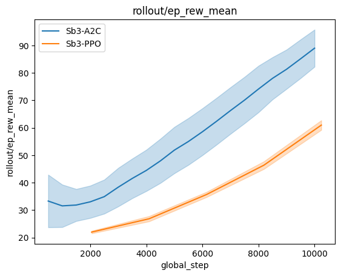
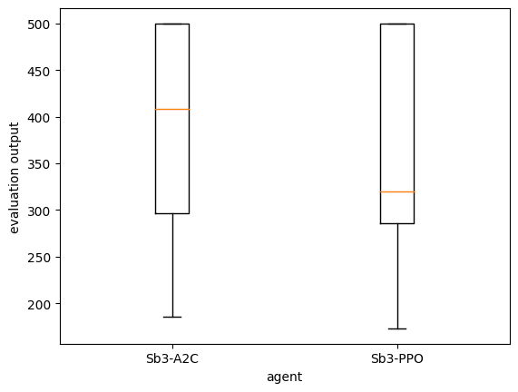

(plot_stats_page)=

# Plotting and Statistics

Similary to an RL research project or coursework, we would like to compare, the performances of PPO and A2C from [stable-baselines3](stable-baselines3.readthedocs.io/en/master/) on CartPole-v1. As well as draw statistical significant conclusions on which agent is better in terms of average evaluation performances.

## Reminder on agent training with ExperimentManager

We first start by training the agents on 10 seeds each using [ExperimentManagers](https://rlberry-py.github.io/rlberry/generated/rlberry.manager.ExperimentManager.html#rlberry.manager.ExperimentManager) and [StableBaselinesAgent](https://rlberry-py.github.io/rlberry/generated/rlberry.agents.stable_baselines.StableBaselinesAgent.html#rlberry.agents.stable_baselines.StableBaselinesAgent).


```python
from rlberry.envs import gym_make
from rlberry.agents.stable_baselines import StableBaselinesAgent
from stable_baselines3 import A2C, PPO
from rlberry.manager import ExperimentManager

env_id = "CartPole-v1"  # Id of the environment

env_ctor = gym_make  # constructor for the env
env_kwargs = dict(id=env_id)  # give the id of the env inside the kwargs

first_agent = ExperimentManager(
    StableBaselinesAgent,  # Agent Class
    init_kwargs=dict(algo_cls=A2C),
    train_env=(env_ctor, env_kwargs),  # Environment as Tuple(constructor,kwargs)
    seed=42,
    fit_budget=int(1e4),
    n_fit=10,
    agent_name="Sb3-A2C",
)
second_agent = ExperimentManager(
    StableBaselinesAgent,  # Agent Class
    init_kwargs=dict(algo_cls=PPO),
    train_env=(env_ctor, env_kwargs),  # Environment as Tuple(constructor,kwargs)
    seed=42,
    fit_budget=int(1e4),
    n_fit=10,
    agent_name="Sb3-PPO",
)
first_agent.fit()
second_agent.fit()
```

```python
from rlberry.manager import plot_writer_data

data = plot_writer_data([first_agent, second_agent], "rollout/ep_rew_mean")
```

    /usr/local/lib/python3.10/dist-packages/rlberry/manager/plotting.py:165: SettingWithCopyWarning:
    A value is trying to be set on a copy of a slice from a DataFrame.
    Try using .loc[row_indexer,col_indexer] = value instead

    See the caveats in the documentation: https://pandas.pydata.org/pandas-docs/stable/user_guide/indexing.html#returning-a-view-versus-a-copy
      data.loc[:, "n_simu"] = data["n_simu"].astype(int)
    /usr/local/lib/python3.10/dist-packages/rlberry/manager/plotting.py:165: DeprecationWarning: In a future version, `df.iloc[:, i] = newvals` will attempt to set the values inplace instead of always setting a new array. To retain the old behavior, use either `df[df.columns[i]] = newvals` or, if columns are non-unique, `df.isetitem(i, newvals)`
      data.loc[:, "n_simu"] = data["n_simu"].astype(int)





```python
from rlberry.manager import evaluate_agents

evaluate_agents([first_agent, second_agent])
```



  <div id="df-d236c75f-11cc-405d-aea2-275c1e62f498" class="colab-df-container">
    <div>
<style scoped>
    .dataframe tbody tr th:only-of-type {
        vertical-align: middle;
    }

    .dataframe tbody tr th {
        vertical-align: top;
    }

    .dataframe thead th {
        text-align: right;
    }
</style>
<table border="1" class="dataframe">
  <thead>
    <tr style="text-align: right;">
      <th></th>
      <th>Sb3-A2C</th>
      <th>Sb3-PPO</th>
    </tr>
  </thead>
  <tbody>
    <tr>
      <th>0</th>
      <td>297.0</td>
      <td>500.0</td>
    </tr>
    <tr>
      <th>1</th>
      <td>408.0</td>
      <td>173.0</td>
    </tr>
    <tr>
      <th>2</th>
      <td>500.0</td>
      <td>500.0</td>
    </tr>
    <tr>
      <th>3</th>
      <td>500.0</td>
      <td>320.0</td>
    </tr>
    <tr>
      <th>4</th>
      <td>186.0</td>
      <td>286.0</td>
    </tr>
  </tbody>
</table>
</div>
    <div class="colab-df-buttons">

  <div class="colab-df-container">
    <button class="colab-df-convert" onclick="convertToInteractive('df-d236c75f-11cc-405d-aea2-275c1e62f498')"
            title="Convert this dataframe to an interactive table."
            style="display:none;">

  <svg xmlns="http://www.w3.org/2000/svg" height="24px" viewBox="0 -960 960 960">
    <path d="M120-120v-720h720v720H120Zm60-500h600v-160H180v160Zm220 220h160v-160H400v160Zm0 220h160v-160H400v160ZM180-400h160v-160H180v160Zm440 0h160v-160H620v160ZM180-180h160v-160H180v160Zm440 0h160v-160H620v160Z"/>
  </svg>
    </button>

  <style>
    .colab-df-container {
      display:flex;
      gap: 12px;
    }

    .colab-df-convert {
      background-color: #E8F0FE;
      border: none;
      border-radius: 50%;
      cursor: pointer;
      display: none;
      fill: #1967D2;
      height: 32px;
      padding: 0 0 0 0;
      width: 32px;
    }

    .colab-df-convert:hover {
      background-color: #E2EBFA;
      box-shadow: 0px 1px 2px rgba(60, 64, 67, 0.3), 0px 1px 3px 1px rgba(60, 64, 67, 0.15);
      fill: #174EA6;
    }

    .colab-df-buttons div {
      margin-bottom: 4px;
    }

    [theme=dark] .colab-df-convert {
      background-color: #3B4455;
      fill: #D2E3FC;
    }

    [theme=dark] .colab-df-convert:hover {
      background-color: #434B5C;
      box-shadow: 0px 1px 3px 1px rgba(0, 0, 0, 0.15);
      filter: drop-shadow(0px 1px 2px rgba(0, 0, 0, 0.3));
      fill: #FFFFFF;
    }
  </style>

  <script>
    const buttonEl =
      document.querySelector('#df-d236c75f-11cc-405d-aea2-275c1e62f498 button.colab-df-convert');
    buttonEl.style.display =
      google.colab.kernel.accessAllowed ? 'block' : 'none';

    async function convertToInteractive(key) {
      const element = document.querySelector('#df-d236c75f-11cc-405d-aea2-275c1e62f498');
      const dataTable =
        await google.colab.kernel.invokeFunction('convertToInteractive',
                                                  [key], {});
      if (!dataTable) return;

      const docLinkHtml = 'Like what you see? Visit the ' +
        '<a target="_blank" href=https://colab.research.google.com/notebooks/data_table.ipynb>data table notebook</a>'
        + ' to learn more about interactive tables.';
      element.innerHTML = '';
      dataTable['output_type'] = 'display_data';
      await google.colab.output.renderOutput(dataTable, element);
      const docLink = document.createElement('div');
      docLink.innerHTML = docLinkHtml;
      element.appendChild(docLink);
    }
  </script>
  </div>


<div id="df-de67d85c-0716-4ca4-b9fd-3d9fd0627e6f">
  <button class="colab-df-quickchart" onclick="quickchart('df-de67d85c-0716-4ca4-b9fd-3d9fd0627e6f')"
            title="Suggest charts"
            style="display:none;">

<svg xmlns="http://www.w3.org/2000/svg" height="24px"viewBox="0 0 24 24"
     width="24px">
    <g>
        <path d="M19 3H5c-1.1 0-2 .9-2 2v14c0 1.1.9 2 2 2h14c1.1 0 2-.9 2-2V5c0-1.1-.9-2-2-2zM9 17H7v-7h2v7zm4 0h-2V7h2v10zm4 0h-2v-4h2v4z"/>
    </g>
</svg>
  </button>

<style>
  .colab-df-quickchart {
      --bg-color: #E8F0FE;
      --fill-color: #1967D2;
      --hover-bg-color: #E2EBFA;
      --hover-fill-color: #174EA6;
      --disabled-fill-color: #AAA;
      --disabled-bg-color: #DDD;
  }

  [theme=dark] .colab-df-quickchart {
      --bg-color: #3B4455;
      --fill-color: #D2E3FC;
      --hover-bg-color: #434B5C;
      --hover-fill-color: #FFFFFF;
      --disabled-bg-color: #3B4455;
      --disabled-fill-color: #666;
  }

  .colab-df-quickchart {
    background-color: var(--bg-color);
    border: none;
    border-radius: 50%;
    cursor: pointer;
    display: none;
    fill: var(--fill-color);
    height: 32px;
    padding: 0;
    width: 32px;
  }

  .colab-df-quickchart:hover {
    background-color: var(--hover-bg-color);
    box-shadow: 0 1px 2px rgba(60, 64, 67, 0.3), 0 1px 3px 1px rgba(60, 64, 67, 0.15);
    fill: var(--button-hover-fill-color);
  }

  .colab-df-quickchart-complete:disabled,
  .colab-df-quickchart-complete:disabled:hover {
    background-color: var(--disabled-bg-color);
    fill: var(--disabled-fill-color);
    box-shadow: none;
  }

  .colab-df-spinner {
    border: 2px solid var(--fill-color);
    border-color: transparent;
    border-bottom-color: var(--fill-color);
    animation:
      spin 1s steps(1) infinite;
  }

  @keyframes spin {
    0% {
      border-color: transparent;
      border-bottom-color: var(--fill-color);
      border-left-color: var(--fill-color);
    }
    20% {
      border-color: transparent;
      border-left-color: var(--fill-color);
      border-top-color: var(--fill-color);
    }
    30% {
      border-color: transparent;
      border-left-color: var(--fill-color);
      border-top-color: var(--fill-color);
      border-right-color: var(--fill-color);
    }
    40% {
      border-color: transparent;
      border-right-color: var(--fill-color);
      border-top-color: var(--fill-color);
    }
    60% {
      border-color: transparent;
      border-right-color: var(--fill-color);
    }
    80% {
      border-color: transparent;
      border-right-color: var(--fill-color);
      border-bottom-color: var(--fill-color);
    }
    90% {
      border-color: transparent;
      border-bottom-color: var(--fill-color);
    }
  }
</style>

  <script>
    async function quickchart(key) {
      const quickchartButtonEl =
        document.querySelector('#' + key + ' button');
      quickchartButtonEl.disabled = true;  // To prevent multiple clicks.
      quickchartButtonEl.classList.add('colab-df-spinner');
      try {
        const charts = await google.colab.kernel.invokeFunction(
            'suggestCharts', [key], {});
      } catch (error) {
        console.error('Error during call to suggestCharts:', error);
      }
      quickchartButtonEl.classList.remove('colab-df-spinner');
      quickchartButtonEl.classList.add('colab-df-quickchart-complete');
    }
    (() => {
      let quickchartButtonEl =
        document.querySelector('#df-de67d85c-0716-4ca4-b9fd-3d9fd0627e6f button');
      quickchartButtonEl.style.display =
        google.colab.kernel.accessAllowed ? 'block' : 'none';
    })();
  </script>
</div>
    </div>
  </div>


## Statistically sound comparison of agents

A posteriori, it is also important to not only  visualise performances but to actually compare them through test statistics.


```python
from rlberry.manager import compare_agents

compare_agents(
    [first_agent, second_agent],
    method="tukey_hsd",
    eval_function=None,
    n_simulations=50,
    alpha=0.05,
    B=10000,
    seed=None,
)
```

  <div id="df-f3437c30-0350-4b04-8159-eea00a2d66ac" class="colab-df-container">
    <div>
<style scoped>
    .dataframe tbody tr th:only-of-type {
        vertical-align: middle;
    }

    .dataframe tbody tr th {
        vertical-align: top;
    }

    .dataframe thead th {
        text-align: right;
    }
</style>
<table border="1" class="dataframe">
  <thead>
    <tr style="text-align: right;">
      <th></th>
      <th>Agent1 vs Agent2</th>
      <th>mean Agent1</th>
      <th>mean Agent2</th>
      <th>mean diff</th>
      <th>std diff</th>
      <th>decisions</th>
      <th>p-val</th>
      <th>significance</th>
    </tr>
  </thead>
  <tbody>
    <tr>
      <th>0</th>
      <td>Sb3-A2C vs Sb3-PPO</td>
      <td>295.525</td>
      <td>368.212</td>
      <td>-72.687</td>
      <td>186.19375</td>
      <td>accept</td>
      <td>0.171699</td>
      <td></td>
    </tr>
  </tbody>
</table>
</div>
    <div class="colab-df-buttons">

  <div class="colab-df-container">
    <button class="colab-df-convert" onclick="convertToInteractive('df-f3437c30-0350-4b04-8159-eea00a2d66ac')"
            title="Convert this dataframe to an interactive table."
            style="display:none;">

  <svg xmlns="http://www.w3.org/2000/svg" height="24px" viewBox="0 -960 960 960">
    <path d="M120-120v-720h720v720H120Zm60-500h600v-160H180v160Zm220 220h160v-160H400v160Zm0 220h160v-160H400v160ZM180-400h160v-160H180v160Zm440 0h160v-160H620v160ZM180-180h160v-160H180v160Zm440 0h160v-160H620v160Z"/>
  </svg>
    </button>

  <style>
    .colab-df-container {
      display:flex;
      gap: 12px;
    }

    .colab-df-convert {
      background-color: #E8F0FE;
      border: none;
      border-radius: 50%;
      cursor: pointer;
      display: none;
      fill: #1967D2;
      height: 32px;
      padding: 0 0 0 0;
      width: 32px;
    }

    .colab-df-convert:hover {
      background-color: #E2EBFA;
      box-shadow: 0px 1px 2px rgba(60, 64, 67, 0.3), 0px 1px 3px 1px rgba(60, 64, 67, 0.15);
      fill: #174EA6;
    }

    .colab-df-buttons div {
      margin-bottom: 4px;
    }

    [theme=dark] .colab-df-convert {
      background-color: #3B4455;
      fill: #D2E3FC;
    }

    [theme=dark] .colab-df-convert:hover {
      background-color: #434B5C;
      box-shadow: 0px 1px 3px 1px rgba(0, 0, 0, 0.15);
      filter: drop-shadow(0px 1px 2px rgba(0, 0, 0, 0.3));
      fill: #FFFFFF;
    }
  </style>

  <script>
    const buttonEl =
      document.querySelector('#df-f3437c30-0350-4b04-8159-eea00a2d66ac button.colab-df-convert');
    buttonEl.style.display =
      google.colab.kernel.accessAllowed ? 'block' : 'none';

    async function convertToInteractive(key) {
      const element = document.querySelector('#df-f3437c30-0350-4b04-8159-eea00a2d66ac');
      const dataTable =
        await google.colab.kernel.invokeFunction('convertToInteractive',
                                                  [key], {});
      if (!dataTable) return;

      const docLinkHtml = 'Like what you see? Visit the ' +
        '<a target="_blank" href=https://colab.research.google.com/notebooks/data_table.ipynb>data table notebook</a>'
        + ' to learn more about interactive tables.';
      element.innerHTML = '';
      dataTable['output_type'] = 'display_data';
      await google.colab.output.renderOutput(dataTable, element);
      const docLink = document.createElement('div');
      docLink.innerHTML = docLinkHtml;
      element.appendChild(docLink);
    }
  </script>
  </div>

  </div>
  </div>


Here the comparison algorithm accepts that the means of agents evaluations are different from a statistical point of view, i.e, one can conclude the PPO is better than A2C in average on CartPole-v1.

### Adaptive number of seeds during training with AdaStop

Finally, rather than fitting A2C and PPO 10 times each, it is possible to fit each agent as little as possible but still get a statistically valid comparison. In order to do so, instead of doing the training of the agent directly with n_fit=K, the number of indenpendent runs n_fit will be chosen adaptively with ```AdastopComparator```.


```python
from rlberry.manager import AdastopComparator

env_ctor, env_kwargs = gym_make, dict(id="CartPole-v1")

managers = [
    {
        "agent_class": StableBaselinesAgent,
        "train_env": (env_ctor, env_kwargs),
        "fit_budget": 1e4,
        "agent_name": "Sb3-A2C",
        "init_kwargs": {"algo_cls": A2C},
    },
    {
        "agent_class": StableBaselinesAgent,
        "train_env": (env_ctor, env_kwargs),
        "agent_name": "Sb3-PPO",
        "fit_budget": 1e4,
        "init_kwargs": {"algo_cls": PPO},
    },
]

comparator = AdastopComparator()
comparator.compare(managers)
print(comparator.managers_paths)
```
  reject
      Agent1 vs Agent2  mean Agent1  mean Agent2  mean diff  std Agent 1  \
    0       A2C vs PPO      278.048      365.285    -87.237   155.561606

       std Agent 2 decisions
    0    53.671506   smaller
    {'A2C': PosixPath('rlberry_data/temp/manager_data/A2C_2024-04-03_15-15-47_671933e0/manager_obj.pickle'), 'PPO': PosixPath('rlberry_data/temp/manager_data/PPO_2024-04-03_15-15-47_79c2d608/manager_obj.pickle')}
