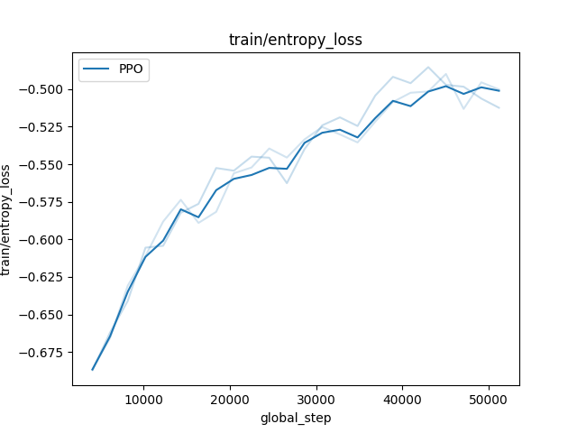

(visu_userguide)=


# Visualization

Good plots and visualization tools are important to design, debug and assess the performance of a RL algorithm.

- *Visualization of the policy of a trained agent*. With gymnasium, it is customary to render the video of an episode of a trained agent, typically with gymnasium's [RecordVideo](https://gymnasium.farama.org/api/wrappers/misc_wrappers/#gymnasium.wrappers.RecordVideo) wrapper. This wrapper can be used in rlberry, but we also have another tool that allow us to render the videos as a gif for some simple environments (Chain and Gridworld from [rlberry-scool](https://github.com/rlberry-py/rlberry-scool/tree/main/rlberry_scool/envs/finite)) as it may be more adapted in some cases (no need for ffmpeg and video codecs).
- *Visualizing training metrics*. In rlberry, all the training data acquisition is done via the writer and we then use mainly the function `rlberry.manager.plot_writer_data` in order to plot the resulting metrics as they are recorded during training.
- *Visualizing evaluations of a trained agent* The user can generate evaluation data for trained agents and plot the resulting evaluation boxplots with `rlberry.manager.evaluate_agents`.

## Generating videos of the policy of a trained agent
To generate a video, we typically use a wrapper around the environment that will record what is happening in the environment and then we generate a video from these recordings. To do that with gymnasium, see  [RecordVideo](https://gymnasium.farama.org/api/wrappers/misc_wrappers/#gymnasium.wrappers.RecordVideo) wrapper, and for a use-case with rlberry see for instance our [DQN on CartPole example](https://rlberry-py.github.io/rlberry/auto_examples/demo_agents/video_plot_dqn.html#sphx-glr-auto-examples-demo-agents-video-plot-dqn-py).

## Generating gif videos

When teaching RL, it may be easier not to have to ask students to install ffmpeg on their computers, and more generally it is most of the time more fool-proof to generate gif instead of videos. This is the prime reasons for our visualization tool `rlberry.rendering.utils.gif_write` that works for rlberry-scool environments `Chain` and `Gridworld` in the following way:

```python
from rlberry.agents import AgentWithSimplePolicy
from rlberry_research.envs import Chain

env_ctor = Chain
env_kwargs = dict(L=10, fail_prob=0.1)
# chain of length 10. With proba 0.1, the agent will not be able to take the action it wants to take.
env = env_ctor(**env_kwargs)
env.enable_rendering()
observation, info = env.reset()
for tt in range(5):
    observation, reward, terminated, truncated, info = env.step(1)
    done = terminated or truncated
env.save_gif("gif_chain.gif")
# clear rendering data
env.clear_render_buffer()
env.disable_rendering()
```


The tool `save_fig` works by collecting all the frames generated by the steps of `env` for each of the steps done after `env.enable_rendering()`.

## Plotting training data and reward curves in rlberry

Training metrics in reinforcement learning are typically very unstable because there is randomness in the training process (e.g. neural networks) and the environment changes during the training. Then, if a single plot is very non-smooth due to the process variablility, it may become necessary to smooth the curve in order to be able to get any information from it.

Plotting training metric in rlberry goes through the use of `plot_writer_data`. The function can take as first argument either a trained rlberry agent (whose writer contains the training data) or a pandas dataframe containing the training data. The dataframe is supposed to adhere to rlberry format and must contain the columns `tag` (description of value being stored), `value` (the value), a column with the x-axis (whose name must be fed to the `xtag` parameter), `n_simu` (identifier for which training this corresponds to if there are several), `name` (name of the agent).

### Plotting unsmoothed curves

If there are very few curves and they are not too "rugged", they can be plotted directly through the parameter `error_representation="raw_curves"`.

```python
from rlberry.envs import gym_make
from stable_baselines3 import PPO
from rlberry.agents.stable_baselines import StableBaselinesAgent
from rlberry.manager import ExperimentManager, plot_writer_data
import matplotlib.pyplot as plt

env_ctor, env_kwargs = gym_make, dict(id="CartPole-v1")

manager = ExperimentManager(
    StableBaselinesAgent,
    (env_ctor, env_kwargs),
    agent_name="PPO",
    fit_budget=5e4,
    init_kwargs={"algo_cls": PPO, "policy": "MlpPolicy", "verbose": 0},
    n_fit=3,
)

manager.fit()

plot_writer_data(
    [manager],
    "train/entropy_loss",
    xtag=None,
    error_representation="raw_curves",
    smooth=False,
)  # xtag = None will use global_step as x-axis
plt.savefig("entropy_loss.png")
```



### Plotting smoothed curves -- synchronized case

### Plotting smoothed curves -- advanced smoothing techniques

## Visualization of evaluations of trained agents in rlberry
